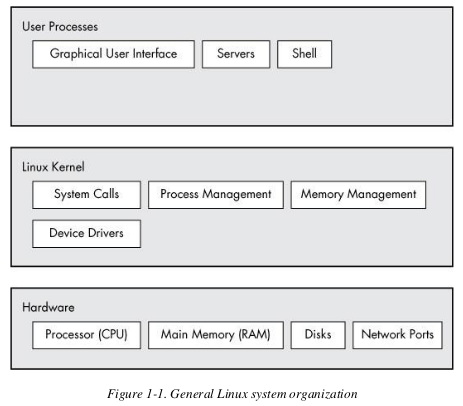
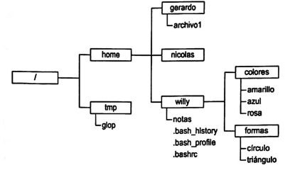
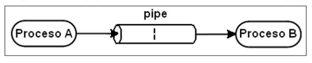
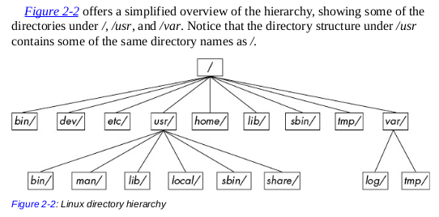

# Introducción a Linux

## ¿Que es linux?

- Sistema Operativo desarrollado por Linus Torvals en 1991

- El término correcto es GNU/Linux.

- Es un S.O. compatible con Unix

- Es uno de lo ejemplos mas destacados del software libre.


### Caracteristicas principales

- **Multitarea**

- **Multiusuario**
- **Multiplataforma**

### Componentes del Sistema Operativo GNU/Linux

Los componentes se pueden agrupar o clasificar en tres capas de abstracción.



**Hardware**

Es la parte física, involucra a la(s) CPU(s), memoria y dispositivos conectados (discos e interfaces de red).

**Kernel**

El kernel es la capa intermedia y en términos generales el Kernel se encarga de **administrar los procesos y recursos de la computadora**.

El Kernel reside en la memoria y le indica al CPU que tareas ejecutar, o sea que trabaja de cerca con esos dos componente.

> Linux técnicamente solo es el **kernel** y no así el S.O.

**Espacio de usuario**

Es el **conjunto de programas o procesos** (denominado *procesos de usuario*) que están en el nivel superior (sobre el Kernel), como  navegadores, juegos, terminales, servicios web, etc.

> **Procesos** o procesos de usuario - son programas en ejecución que administra el kernel.

---

Adicionalmente en una capa externa se podría considerar los usuarios

Un **usuario** no necesariamente es una persona, sino puede ser cualquier entidad capaz de **ejecutar procesos**. For example, all web servers run as user processes.

El kernel de Linux identifica a los usuarios mediante un ID (user ID), Un usuario tiene sus propios procesos que puede manipularlos (dentro sus límites) pero no puede interferir en los procesos de otros, a si mismo, un usuario tiene sus propios archivos y puede compartirlos con otros.

---


## Distribuciones

Es la unión del kernel (de linux) y varias aplicaciones, además proporcionan distintos procedimientos de instalación y actualización.


> El único elemento común entre ellas es el kernel.

Distribuciones ....   :

> VER DEL curso LINUX BASICO


Para obtener información sobre la distribución:

```bash
lsb_release -a
```

También es posible verlo en el fichero `/etc/os-release`

```bash
cat /etc/os-release
```


## Shell

Shell o interprete de comandos, es un programa que ***ejecuta comandos*** y que a la vez nos permite interactuar con el Sistema Operativo.

> El **shell** es la interfaz entre el usuario final y el kernel de Linux.

Existen diferentes shells, todos derivan de *Shell Bourne*:

+ Shell Bourne (sh) - es uno de los primeros shell, desarrollado por Bell Labs.
+ __Bourne Again Shell (bash)__ - Es una versión mejorada de sh.
+ C-Shell (csh)
+ Shell Korn (ksh)
+ entro otros.

La mayoría de las distribuciones linux utilizan por defecto el intérprete de comandos “bash”.

```bash
echo $SHELL
```

Los ejecutables se encuentran en `/bin/` o en la lista de `/etc/shells`


> El shell también es un pequeño entorno de programación, generalmente usado para hacer *shell scripts* (o en corto scripts).

> **Terminal** es el programa (con fondo negro y texto) donde se ejecuta el shell, Es común que haya varios terminales cuando arranca el S.O. Uno de ellos ejecutará la interfaz gráfica si es el caso. 
>
> Para cambiar entre terminales: Ctrl+Alt+f1, Ctrl+Alt+f2, ...
>
> Las terminales que se abren en un sistema con GUI, son **emuladores de terminal**. p.e.  "MATE Terminal", "Terminator", etc.

### Entorno de trabajo

#### Prompt

El prompt es el conjunto de símbolos y caracteres que se muestran en la terminal e indica que está a la espera de comandos.

```
usuario@nombremaquina:/directorio/actual$
```

> Nota clase; mostrar un ejemplo y preguntar por las partes del prompt.

Tipos de usuario

- Usuario normal: $
- Superusuario (o root): #

> Para cambiarse a root `su -l`

#### Estructura de un comandos

**Sintaxis**

`comando [-opciones...] [args...]`

Las opciones se denotan con:

- un guión `-` seguido de una letra. (versión corta)
- dos guiones `--` seguido de una palabra. (versiónS larga)

```bash
ls -d /etc
ls --directory /etc
```

> Los comando son **case sensitive**

#### Path - Rutas en Linux

Es la manera de identificar la ubicación (referencia) de un archivo o directorio.



- Ruta absoluta: `/home/willy/colores/azul.txt`
  Se indica desde la raíz `/`
- Ruta relativa: `colores/azul.txt`
  Se indica desde la ubicación actual 

> **Referencias especiales**
>
> + punto `(.)`: directorio actual.
> + dos puntos `(..)`: directorio padre.
> + `~` representa el directorio home del usuario actual.

## Comandos básicos

### Comandos de ayuda

- Versión larga: `man <comando>`
- Versión corta: `<comando> --help`

> To search for a manual page by keyword, use the -k option: `man -k keyword`

### Manejo de directorios

ls, pwd, cd, mkdir, rmdir

> ls - por defecto muestra el dir actual, y la opción mas usada -l

> cd - sin argumentos retorna al directorio home. 
> Este comando es *shell built-in*

> rmdir - solo elimina directorios vacíos.

#### Bash globbing (comodines) - basico

Se usa para emparejar los nombres de archivos (y directorios) mediante simples patrones.

Comodín asterisco `*` - empareja con cualquier cantidad de caracteres.

```bash
echo *
ls at*
ls *at*
ls *at
```

Comodín interrogación `?` - empareja con un caracter cualquiera.

> Si no se quiere ese comportamiento (bash glob), encerrar entre comillas simple `'*'`  p.e. `echo '*'` 

> Existen mas patrones... COMPLETAR  EN EL CURSO LINUX BASIC.

### Manejo de ficheros

echo - imprime lo que se le pasa como argumento

touch, cp, mv, rm, cat, more, less, head, tail, diff, file,

> touch - crea un archivo, si ya existe no lo reemplaza pero si modifica su timestamp

```bash
# cp
# copiar cambiando el nombre 
cp file1 file2
# mantener el nombre  
cp file1 dir
# copiar multiples archivos 
cp file1 file2 dir
```

```bash
# mv
# renombrar archivos
mv file1 file2
# mover archivos
mv file1 dir
```

> rm - Para eliminar directorios (no vacios) `rm -r`

> cat - mostrar varios archivos al vez `cat file1 file2`

> less - press `spacebar` para ir a la siguiente página, y `b` para volver a la anterior. Press `q` para salir.
>
> ejem: `less /usr/share/dict/words`
>
> Se puede buscar texto, type `/word` para buscar coincidencias hacia adelante y type `?word` buscará las coincidencias hacia atras, press `n` para ir a la siguiente coincidencia (atras o adelante depende la búsqueda).

¿diff entre more y less?

>The `less` command is an enhanced version of an older program named `more` . Linux desktops and servers have `less` , but it’s not standard on many embedded systems and other Unix systems. If you ever run into a situation when you can’t use `less` , try `more` .

> diff -  muestra las diferencias entre dos ficheros de texto. Una opción interesante es `-u` muestra mas info similar a la de git. Según el libro se usa cuando envias esta info a otras herramientas automatizadas, NOSE  A CUALES PERO BUENO ME PARECIO INTERESANTE.

> tail - To print lines starting at line n , use `tail +n` .

### Búsquedas de archivos

find, whereis, locate...

> find - El uso más común es la opción `-name <filename/pattern>` 
>
> El patrón debe ir entre comillas simples `'*'` para evitar confusión con los caracteres especiales del shell. `find /etc -name '*.conf'`

> locate - encuentra mas rápidamente que find, porque busca en un espacio indexado que el sistema actualiza cada cierto tiempo. La desventaja es que los archivos más recientes no serán encontrados.

### Comandos filtro

sort, cut, wc, grep, tr, ...

> grep - dos opciones importantes son -i (case-insensitive), -v (invierte, imprime lo que no empareja).
>
> There is also a more powerful variant called egrep (which is just a synonym for grep -E ).
>
> Trabaja con expresiones regulares, son muy útiles para realizar búsquedas con patrones (mas avanzado que los comodines). Tres casos mas importantes son:
>
> - `.*` - empareja con cualquier (0 o mas) cantidad de caracteres,
> - `.+` - empareja con 1 o más caracteres cualquiera.
> - `.` - empareja con solo 1 caracter cualquiera.

> sort - ordena las lineas de texto en orden alfanumérico. 
>
> Usar la opción `-n` para ordenar numéricamente. Y `-r` invertir el orden.

### Editores de texto

nano, vim

Usar con el que te sientas más cómodo.

Nano es un editor mucho más amigable que vi o vim.

> `vimtutor` muestra tutorial breve de vim

### Compresión de archivos

tar, zip

```
# comprimir
tar -cvzf fotos.tgz fotos/

# descomprimir
tar -xvf fotos.tbz2
```

> Las opciones -z y -j indican el algoritmo de compresión gzip y bzip2 respectivamente.

manejo del sistema

top, free, ps, date, poweroff, reboot, ...

## Conceptos básicos

### Dot Files

Son archivos (y directorios) que su nombre empieza con punto `.`, Por los general son archivos de configuración como `.bashrc` o `.login`. Algunos programas los ocultan, como el comando `ls`, pero si se le pasa la opción `-a` los mostrará. 

### Variables de Entorno y de Shell

El shell puede almacenar temporalmente variables, con valor tipo string (texto).

Hay dos tipos de variables:

1. Variables de shell - solo pueden ser accedidos en el shell actua.

   ```bash
   STUFF=blah
   ```

2. Variables de entorno - a diferencia del anterior estas variables si pueden ser accedidas por los comandos que ejecuta el shell actual. es decir, que el sistema operativo pasará todas sus *variables de entorno* al programa.

   ```bash
   export STUFF=blah
   ```

   Un ejemplo de uso es el comando `less`, este comando usa la variables de entorno LESS para tomar opciones. VER EL MANUAL PARA SABER COMO DEFINIR ESTA VARIABLES.

> **Nota:** no colocar espacios en el nombre de la variable. 

#### Variable de entorno PATH

Es una de las más importantes, contiene una lista de directorios donde se encuentran los comandos que el shell puede ejecutar.

```bash
echo $PATH
#/usr/local/bin:/usr/bin:/bin:/usr/local/games:
```

Cada directorio está separado por (:).

Si el comando no se encuentra en ningún directorio de la variable `PATH`, entonces recibirás un error, `command not found`:

```bash
sysadmin@localhost:~$ zed       
#-bash: zed: command not found
```

Para agregar un nuevo directorio, se usa: 

```bash
$ PATH=newdir/bin:$PATH   #<--recomendado
# o
PATH=$PATH:newdir/bin
```

Dependiendo el caso, el comando se buscará en el orden de la lista de directorios.

## Standard Input and Standard Output

> AQUI IRÁ UNA INTRO SOBRE LOS INPUT AND OUTPUT STREAMS, YA ESTÁ RESALTADO EN EL LIBRO. HOW LINUX WORKS 3ED PG 46

**Redirección y tuberias**

Cuando se ejecuta un comando, se crea un proceso que tiene inicialmente abiertos 3 canales (streams):


STDIN (Entrada estándar) (0) <-- es el teclado

STDOUT (Salida estándar) (1) --> es la pantalla.

STDERR (Error estándar) (2) --> es la pantalla. es información (diagnostig and debugging) que se muestra cuando un comando falla.

### **Redireccionamiento**

Con el redirecionamiento podemos redirigir la salida de un comando a un fichero de texto.

```bash
# redirecc. salida estándar '>'
ls -l > listado.txt
# Crea un fichero pero si ya existe lo reemplaza (OJO).

# Con la redirección '>>' se añade la salida estandar al final del fichero.
ls -l /opt >> listado.txt

# redirecc. error estándar '2>'
ls /fake 2> errs.txt

# se puede especificar diferentes archivos para STDIN y STDOUT
ls /fake /etc/ppp > output.txt 2> error.txt

# redirecc. ambas salidas al mismo fichero
ls -l /home /fake &> all.txt

# redirecc. entrada estándar '<'
cat < listado.txt
tr 'a-z' 'A-Z' < example.txt
# En la mayoria de los comandos Unix no es necesario el uso de este operador, porque por defecto redirigen el contenido del fichero que se le pasa como argumento.
```

> `tr` es uno de los pocos comandos que requiere el uso de `<`

**Pregunta**: que hace esto ` tr 'a-z' 'A-Z' < example.txt > newexample.txt `?

### **Tuberias (pipes)**



Linux permite transferir datos entre comandos denominado "piping".

La salida estándar de un comando se puede enviar a la entrada estándar de otro comando mediante el operador `|`.

```bash
history | more

head /proc/cpuinfo | tr a-z A-Z

cat nombres.txt | tr 'a-z' 'A-Z'

cat nombres.txt | grep jairo | wc -l 
```

> TAREA: Practica sobre comandos de linux

## Estructura del árbol de directorios




> TAREA: 
>
> 1. Linux Directory Hierarchy Essentials
> 2. The /usr Directory
> 3. Kernel Location

## Proceso de arranque

De manera simple todos los sistemcas arrancan de manera similar:

1. La BIOS toma el control de la computadora, detecta los discos y carga el MBR (*Master Boot Recovery*) y ejecuta el *bootloader*

   > En sistemas modernos este proceso depende del sistema UEFI

2. El *bootloader* (GRUB) y busca la imagen del kernel en el disco y lo carga en memoria

3. El kernel inicializa los dispositivos y sus drivers correspondientes

4. El kernel monta el sistema de archivos raiz (/) 

5. El kernel inicia el primer programa *init* con PID 1

6. *init* corre el resto de procesos del sistema

```
BIOS+MBR | UEFI
Bootloader
Linux Kernel
	Particion y filesystem root /
init (systemd)
```


Tarea: Tablas de particiones MBR y GPT.
