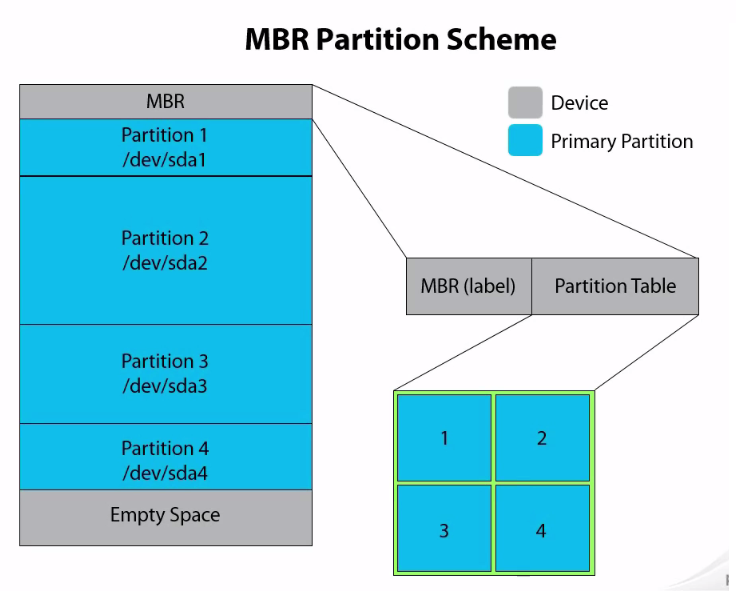
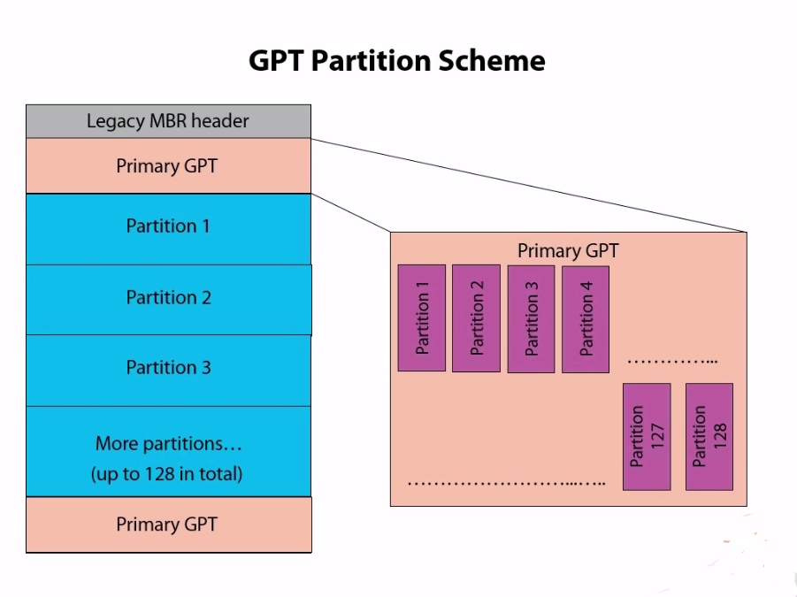

# Particiones

Las **particiones son porciones virtuales** de disco que se crea con el fin de **instalar un Sistema Operativo** o simplemente **almacenar información** (datos).

Casi cualquier sistema operativos **interpreta, utiliza y manipula cada partición como un disco independiente**. a pesar de que físicamente es un solo disco.

```
====== Disco Duro (físico) ========
= |-------| |------| |----------| =
= |   p1  | |  p2  | |    p3    | =
= |-------| |------| |----------| =
===================================
```

> Para que la partición sea utilizable, se debe instalar (o "formatear" con) un sistema de archivos (*filesystem*).

**¿Porque usar múltiples particiones?**

* Instalar mas de un S.O. en un Disco duro.
* Proteger los archivos todo lo posible (si se daña una partición, no afecta a las demás).
* Separar los datos de los usuarios.

## Tipos de particiones

Existen 3 tipos de particiones:

1. Particiones Primarias
2. Particiones Extendidas
3. Particiones Lógicas

El uso de estas particiones, será sujeto al esquema de particionado que se tenga, esquema de partición MBR o GPT.

## Esquemas de particiones

Básicamente se tiene dos tipos de esquemas de particionado de discos.

### Esquema de partición MBR

El esquema MBR es una estructura antigua y ámpliamente utilizada para particionar discos. Fue introducido en la década de 1980 y se usa en sistemas con BIOS.

Las particiones que admite son:

+ **Primaria**: son la que se utiliza normalmente, se puede crear **hasta 4 particiones primarias** en un disco duro. 
+ **Extendida**: Solo se puede crear 1 partición extendida por disco. Sirve para contener múltiples unidades lógicas (particiones lógicas) con la finalidad de superar el límite de 4 particiones primarias por disco. 
+ **Lógica**: Es una porción de la partición extendida y se puede crear hasta 15 particiones lógicas, tienen el mismo propósito que una partición primaria.

> **Nota**: MBR no puede manejar discos de más de 2 TB.


Este tipo de esquema contiene un sector, del mismo nombre, llamado MBR (*Master Boot Record*), este es el primer sector (o sector 0) del disco duro de 512 bytes, almacena una parte del bootloader y la tabla de partición.

> Los primeros 440 bytes contiene la primera parte del bootloader, 64 bytes para la tabla de partición y 6 bytes para MBR validation timestamp.



### Esquema de partición GPT

Para superar las limitaciones que tenia MBR (hasta 4 particiones y máximo 2TB de disco).  Se creó una nuevo esquema de partición llamado GPT, el cual **es parte del estándar UEFI**.

El esquema de particionado GPT (GUID Partition Table) no utiliza particiones extendidas. **Todas se crean como particiones primarias**.

En este tipo de esquema se puede crear **hasta 128 particiones primarias** en Windows y 256 en Linux.

> GPT puede manejar discos grandes hasta 9.4 ZB.

* Es un tipo de esquema de partición que usa globally unique identifiers (GUID). ~~¿COMO? NOSE~~

* Si se quiere usar GPT en el disco, se debe **habilitar el UEFI** (Aunque ya los ordenadores modernos vienen con este firmware por defecto).

  > También es posible usarlo con BIOS pero no se recomienda.

* El primer sector del disco GPT es de 512 bytes, se denomina **MBR-protector**, se utiliza para proporcionar compatibilidad con firmwares antiguos (como el BIOS), el MBR-protector contiene una sola entrada que describe toda la unidad GPT como una partición única.

* Este esquema contiene **dos sectores** llamados **Primary GPT header** (contiene la tabla de particionado), para proporcionar redundancia en caso de que uno ellos se corrompa.



> *GPT no admite sistemas operativos Windows anteriores a la versión 8, ni versiones Windows de 32 bits, ni tampoco versiones antiguas de Linux*

### ¿Debo usar MBR o GPT en Linux?

Una de las mayores ventajas de GPT sobre MBR es que, en un disco MBR, los datos de arranque y partición se almacenan en un solo lugar, mientras tanto en GPT almacena dos copias (al inicio y al final del disco), por lo que se puede recuperarlos si se dañan.


> Ver el tipo de tabla de partición: `sudo parted -l`
>
> ```bash
> carlos@debian:~$ sudo parted -l
> ...
> Sector size (logical/physical): 512B/4096B
> Partition Table: msdos   <<-- (tipo MBR)
> ...
> ```

# Arranque por BIOS y UEFI

A continuación se describe el proceso de arranque desde que se enciende la PC hasta que se carga el bootloader.

Dependiendo de la máquina si tiene BIOS/MBR o UEFI el proceso de arranque será diferentes.

## BIOS

BIOS (Basic Input/Output System) es un programa (firmware) almacenado en un chip de memoria de la placa madre. Este firmware asume que en los primeros 440 bytes del primer disco, está la primera parte del bootloader y lo carga.

A grandes rasgos los pasos del arranque por BIOS:

1. Se ejecuta el proceso POST (power-on self-test), identifica fallas del hardware antes que la máquina encienda.
2. La BIOS se ejecuta y reconoce los dispositivos como keyboard, video output y dispositivos de almacenamiento.
3. La BIOS carga (la primera parte del) bootloader desde el MBR. 
4. La primera parte del bootloader llama a la segunda parte, quien es responsable de cargar el kernel. 

## UEFI

UEFI (*Unified Extensible Firmware Interface*) también es un firmware con mas funcionalidades (capaz de i**dentificar particiones y navegar el sistemas de archivos**), sus configuraciones se almacenan en NVRAM (memoria no volátil) que está en su placa madre, estas configuraciones indican la ubicación de las *EFI appliactions*.

> Las ***EFI appliactions*** son bootloaders, selectores de S.O, herramientas de diagnostico y reparación, etc.

Las *EFI applications* se encuentran en una partición del disco duro llamada ESP (EFI System Partition). Esta partición contiene el directorio "EFI" que a su vez contiene las *EFI applications*.

Los pasos de arranque con sistemas UEFI:

1. Se ejecuta el proceso POST (power-on self-test), identifica fallas del hardware antes que la máquina encienda.
2. El UEFI carga los componente básicos para el keyboard, video output y dispositivos de almacenamiento.
3. El **UEFI lee las configuraciones** de la NVRAM para **ejecutar alguno de los *EFI applications*,** usualmente es un bootloader.  
4. El bootloader cargará el sistema operativo.

> Referencias. 
>
> 1. LPIC-1 101 pg 21 BIOS or UEFI
> 2. How Linux Work 3ed pg 194

### How to determine if uses BIOS or UEFI 

To determine if your system uses a BIOS or UEFI, run efibootmgr . If you get a list of boot targets, your system has UEFI. If instead you’re told that EFI variables aren’t supported, your system uses a BIOS.
Alternatively, you can check to see that /sys/firmware/efi exists; if so, your system uses UEFI.