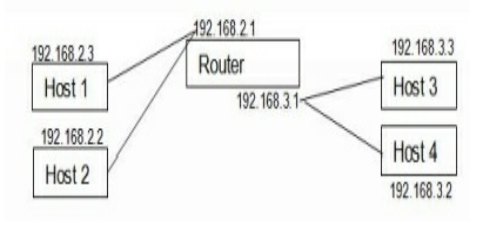

Rutas y tablas de enrutamiento

Los routers permiten conectar varias redes (o subredes).



El roter dispone de mas de una IP, pero no necesariamente significa que también deberán contar con varias interfaces de red porque se puede configurar subinterfaces, es decir usar solo una interfaz física pero simular varias interfaces.

Puede recibir por una de sus interfaces de red y reenviar los mensajes por otra o por la misma, según su **tabla de enrutamiento**.

Las máquinas que están en la misma red se pueden alcanzar directamente sin necesidad de un router, esto se conoce como **entrega directa**.

Las máquinas que se encuentra en otras redes solo podrán comunicarse mediante un router.

Todos los sistemas Linux cuentan con tablas de enrutamiento que les permite decidir por cual interfaz de entregas los mensajes.

Para ver la tabla de enrutamiento se puede usar el comando `ip`

```
ip route
default via 192.168.32.2 dev ens33 
192.168.32.0/24 dev ens33 proto kernel scope link src 192.168.32.150 
```

cada línea es una regla. Las reglas se evaluan en el orden en que aparecen. 

La última línea indica que los mensaje con destinatario 192.168.32.0/24 se enviará por la interfaz ens33, "scope link" es una entrega directa.

Ruta por defecto (default via)

Es una regla que coincide con cualquier IP, es la última regla de la tabla de enrutamiento.


## Configuración de NAT en Linux

<!--ESTO LO TENGO SOLO EN DIAPOSITIVAS EN EL DRIVE-->
