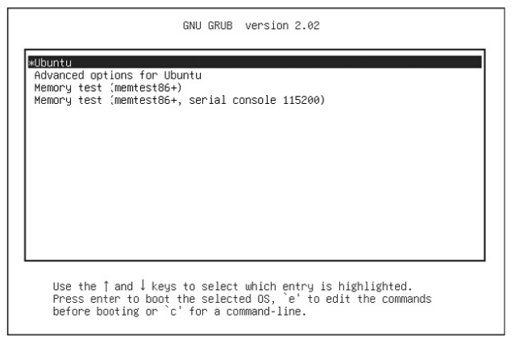
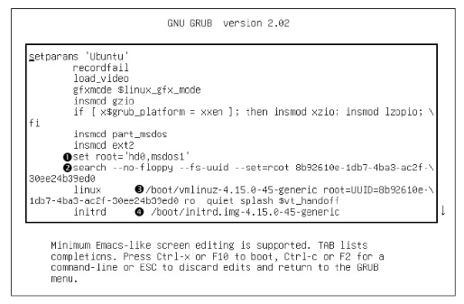
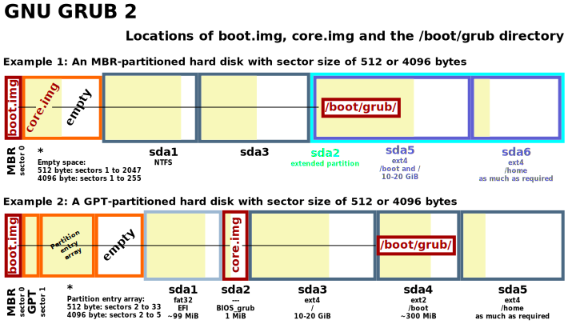

# Gestor de arranque - GRUB

> <!--OJO VOY A USAR LOS TERMINOS FILESYSTEM Y PARTICIÓN DE MANERA INDISTINTA, AUNQUE TECNICAMENTE SON DIFERENTES, PERO ES MÁS FACIL ENTENDER CUANDO INDICAMOS PARTICIÓN. O QUIZAS SOLO ES COSTUMBRE. JEJEJ.-->

> **Tarea previa**: Tablas de particiones MBR y GPT.

## Gestor de arranque (Bootloader)

Un **gestor de arranque** es un programa que administra el arranque del sistema operativo. Tecnicamente su tarea principal es **cargar el kernel en memoria** y ejecutarlo.

> Gestor de arranque = Cargador de arranque = Bootloader

Un gestor de arranque también tiene otras funcionalidades:

- En caso de tener múltiples S.O., nos permite elegir con el que arrancará.
- Permitir escoger entre múltiples kernels.
- Permitir editar los parámetros del kernel antes de que arranque.

Un bootloader necesita drivers para acceder a los discos, por lo que usa a la BIOS o UEFI para esto. 

> Los **discos actuales tienen firmware** que permiten a la BIOS y UEFI acceder a sus datos mediante *Logical Block Addressing* (LBA), es simple pero poco eficiente, pero es suficiente para que el bootloader pueda acceder a los discos.

### Gestores de arranque más conocidos:

+ **GRUB** - Puede trabajar en máquinas con UEFI o BIOS/MBR, es el **más usado** en distribuciones Linux. *Ref.[www.gnu.org/software/grub/](https://www.gnu.org/software/grub/)*

+ **LILO** - Uno de los primeros gestores de arranque de Linux. **ELILO** es una versión para UEFI. (Last version 2015-11-22  version 24.2)

  > https://wiki.debian.org/LILO#Installation  por si algun rato me animo a probarlo :)

+ **Syslinux** - Puede arrancar diferentes tipos de sistema de archivos, incluyendo FAT, ext2, ext3, ext4, btrfs y NTFS.

+ **GAG** - EL GESTOR DE ARRANQUE GRÁFICO, Permite arrancar hasta 9 sistemas operativos diferentes. Última actualización 2013.
  ref.: https://gag.sourceforge.net/es-index.html

+ **Otros bootloaders**: https://wiki.debian.org/BootLoader

## GRUB

GRUB (*Grand Unified Bootloader*) es un bootloader que viene por defecto en la mayoría de Sistemas Operativos GNU/Linux.

Actualmente está en la **versión 2** (GRUB 2) y es compatible tanto con sistemas UEFI como BIOS/MBR.

Permite arrancar Sistemas Operativos GNU/Linux o Windows (*según mi experiencia :)* ),

El archivo principal de configuración es `/boot/grub/grub.cfg` pero no se recomienda su edición manual. Las configuraciones del GRUB consisten de comandos propios, de hecho el GRUB tiene su propio kernel y módulos que se cargan dinámicamente (p.e. para cargar filesystems, drivers genéricos, etc.).

> Estos módulos son Independientes del kernel de Linux, asi mismo muchos comandos se parecen a los comandos de Linux pero no lo son (mas adelante vemos algunos comandos)

> Los módulos están en `/boot/grub/i386-pc`, son archivos con extensión `.mod`.
>
> Ejemplo: hay un GRUB module para LVM (`lvm.mod`), para SO que fueron instalados sobre volúmenes lógicos.



### Acciones en el menú del GRUB

Para acceder al menú del GRUB, mantener presionado SHIFT (en sistemas con BIOS) o ESC en sistemas con UEFI.

Una vez en el menu del GRUB, podemos:

- **presionar la tecla e**, para entrar al **modo edición** de configuración de comandos y parámetros. Estos dependerá de la entrada sobre el cual estamos seleccionando.

  A continuación se puede ver un ejemplo:

  

  * 1 - GRUB root - indica la partición (filesystem) donde está el kernel y  nitrd.

  * 2 - Buscará el UUID=0b...ed0 en las particiones, si lo encuentra lo reemplará el GRUB root.

  * 3 - La linea que empieza por "*linux*" es la más importante, contiene los parámetros del kernel para arrancar el S.O.

  * 4 - Indica la ruta del sistema de archivo RAM inicial (initrd) (se explicará mas adelante quizas con mas detalle, pero si se menciona en el tema kernel)

    > *Para mas detalles sobre el significado de los parámetros ver la sección "Parámetros del kernel"*.
    
    Una duda general es la palabra *root*, básicamente hay dos palabras root: 
    
    + el del comando `linux` hace referencia a la partición raíz. 
    + Y las otras palabras *root* (en las demás lineas, p.e. set root='..) hacen referencia a la partición "boot" (que contiene la imagen del kernel de Linux y la imagen del filesystem RAM (initrd)).
    
    > **Nota**: En instalaciones donde solo se tiene una partición para todo el S.O. (es decir cuando el directorio /boot está dentro la partición raíz), todas las palabras *root* harán referencia a la misma partición.

  Estas configuraciones se pueden editar (efecto temporal), y dependiendo del caso, se puede usar para corregir errores de arranque del sistema o **el caso mas usado, para resetear contraseña del superusuario (root) de Linux** (Ver la sección mas adelante "*Restablecer contraseña de root*").

- **presionar la tecla c**, para entrar a la **Linea de Comandos del GRUB**. El GRUB tiene sus propios comandos (similares a Bash). 

  Algunos de los comandos son:

  > GRUB nombra a los Discos como (hdX) y a las particiones (hdX,mdosY). Donde **X** es 0 en adelante (0 se refirere al primer disco, 1 al segundo, así sucesivamente) y **Y** va desde 1. p.e `hd0,msdos1` primera partición del primer disco. 
  
  ```shell
  ### Listar dispositivos
  grub>ls
  (hd0)	(hd0,msdos1)	(hd0, msdos5)
  # hd0: 1er Disco Duro.
  # msdos1: 1ra partición del 1er disco, con tabla de partición MBR.
  # gpt: si su tabla de partición fuera GPT
  
  grub>ls -l
  # muestra información detallada, como el UUID y otras mas.
  
  ### Navegación del filesystems
  grub> echo $root
  hd0,msdos1
  # $root es la variable que contiene la partición donde está el kernel de Linux (que puede ser la partición / o /boot) (adicionamente aquí también está las conf del GRUB).
  
  # Listar los directorios y archivos, se añade /
  grub>ls (hd0, msdos1)/
  grub>ls ($root)/
  
  # ver las variables del GRUB
  grub> set
  color_highlight=black/white
  color_normal=white/black
  
  
  # apagar el equipo
  grub>halt
  ```
  
  Para salir y retornar al menú del GRUB, presionar ESC.
  
  > **Ojo**: Hasta este punto el kernel aun no esta cargado.

### Configuraciones del GRUB

El directorio de configuración es `/boot/grub` y su principal archivo es `grub.cfg`, pero no se debe modificar manualmente ya que es generado automáticamente (por el comando `grub-mkconfig` que se indicará más adelante).

#### Archivo de configuración grub.cfg

El archivo`grub.cfg` contiene un montón de comandos propios de GRUB, Estos comandos definen el comportamiento inicial (antes de que se muestre el menú del GRUB). 

Una de los comando mas relevante es `menuentry` que define las entradas del menú.

```
menuentry 'Windows 10 (on /dev/sda1)' --cla ...
```

Otro comando importante es `submenu`, contiene múltiples comandos `menuentry`, se usa para distribuciones que tienen múltiples kernels.

```
submenu 'Advanced options for Debian GNU/Linux' $menuentry_....
    ...
    menuentry 'Debian GNU/Linux, with Linux 5.10.0-16-amd64 (recovery mode)'
    ...
    menuentry 'Debian GNU/Linux, with Linux 4.19.0-8-amd64'
```

### Personalizar el GRUB

Para hacer configuraciones del GRUB se debe editar : `/etc/default/grub` o `/etc/grub.d/<scripts>`. 

Luego de hacer cualquier cambio, se debe generar el archivo de configuración principal `grub.cfg`. Para generar este archivo se ejecuta: 
`grub-mkconfig -o /boot/grub/grub.cfg`

> En Debian, se puede ejecutar `update-grub` para genera el archivo `grub.cfg`

Los archivos de del directorio `/etc/grub.d/` **son scripts shell (sh)** que generan partes de la configuración GRUB y se añaden al archivo `grub.cfg` cuando se ejecuta el comando `grub-mkconfig`. 

#### Configuraciones básicas

Para hacer configuraciones básicas del GRUB se debe editar el archivo `/etc/default/grub`

> Las instrucciones se escriben como CLAVE=valor
> *Si el valor contiene espacios debe estar entre comillas (")* 

+ `GRUB_DEFAULT=0` Indica cual es el sistema predeterminado que se cargará. 0 indica que se cargará el SO que está en la primera linea del menú del GRUB.
+ `GRUB_TIMEOUT=10` Deja un margen de 10 segundos para seleccionar un sistema.
+ `GRUB_TIMEOUT_STYLE=menu|countdown|hidden`
  + **menu** es por defecto y muestra el menu del grub, 
  + **countdown** mostrará un contador, para ingresar al menu del grub presionar ESC o Shift.
  + **hidden** no muestra nada pero espera el timeout antes de arrancar el SO por defecto. presionar ESC o Shift para entrar al menu.

+ `GRUB_DISABLE_RECOVERY=true` Deshabilita el modo recovery.
+ `GRUB_BACKGROUND="/ruta/imagen.png"` Imagen que se muestra en la pantalla de inicio (.png, .tga, .jpg, or .jpeg).

Luego de hacer las modificaciones, se debe generar nuevamente el archivo `grub.cfg`. En Debian se puede ejecutar `update-grub`

> **Nota 1**: De manera general (para cualquier sistema Linux): `grub-mkconfig -o /boot/grub/grub.cfg`. 

> **Nota 2**: En Debian el comando update-grub y update-grub2 son lo mismo.

Más info, GRUB Simple Configurations: https://www.gnu.org/software/grub/manual/grub/html_node/Simple-configuration.html#Simple-configuration

#### Añadir nuevas entradas al menú del GRUB

> **Añadir nuevas entradas al menú del GRUB**, se debe:
>
> + Crear un archivo `custom.cfg` con las configuraciones y añadirlo a `/boot/grub/`. (este archivo debería tener comandos de GRUB)
> + Editar uno de los scripts `40_custom` y `41_custom` del directorio `/etc/grub.d/`. El libro (how linux work 3ed) **recomienda editar *41_custom***.
> + Generar el archivo `grub.cfg` ejecutando: 
>   `grub-mkconfig -o /boot/grub/grub.cfg`
>
> > <!--ESO ES BASICAMENTE LO QUE DICE EL LIBRO HLW 3ED, NO DA UN EJEMPLO MAS CLARO. VEO QUE ESTO SERIA PARA USUARIOS MAS AVANZADOS EN LO QUE ES GRUB-->.
> >
> > EN EL LIBRO LPIC1 101 pg 73 hay un ejemplo básico, <!--CUANDO TENGAS TIEMPO LO HACES.-->

> **Referencias:**
>
> - Debian-hackbook 8.8.3. GRUB 2 Configuration pg 182
> - How Linux Work 3ed pg 191.


#### Contraseña del GRUB

Es importante por temas de seguridad establecer una contraseña para el GRUB, así evitar que cualquier persona con acceso a la máquina física pueda editar los parámetros iniciales o entrar a la terminal del GRUB.

> Ejemplo. Es posible resetear la contraseña del root, editando el parámetro `init=/bin/bash` en el menú del GRUB. 
> (Ver la sección "*Reestablecer contraseña del root*")

GRUB permite definir usuarios y contraseñas (independientemente de los usuarios del Sistema Operativo). La configuración se realiza en el archivo `/etc/grub.d/40_custom`

Para crear usuarios, definir la variable *superusers*. Luego definir la contraseña con el comando `password` (contraseña texto plano) o `password_pbkdf2` (contraseña cifrada).

Por ejemplo, para el **caso sin cifrado** de contraseña:

1. Agregar las sig. lineas en `/etc/grub.d/40_custom`

   ```
   set superusers="admin1 admin2"
   password admin1 micontraseña
   password admin2 mi_contraseña
   ```

Para el **caso con contraseña cifrada**:

1. Generar la contraseña cifrada con el comando `grub-mkpasswd-pbkdf2`

2. Copiar la contraseña cifrada: `grub.pbkdf2.sha512.10000.i...`

3. Editar el archivo `/etc/grub.d/40_custom` y pegar la contraseña cifrada.

   ```
   set superusers="admin2"
   password_pbkdf2 admin2 grub.pbkdf2.sha512....
   ```

Luego de terminar las configuraciones, refrescar los cambios con `update-grub`

> **Referencias**: Descripción [grub.html#Security](https://www.gnu.org/software/grub/manual/grub/grub.html#Security), 
> comando para asignar pass [password_pbkdf2](https://www.gnu.org/software/grub/manual/grub/grub.html#password_005fpbkdf2) 
> y para generar el hash [Invoking grub-mkpasswd-pbkdf2](https://www.gnu.org/software/grub/manual/grub/grub.html#Invoking-grub_002dmkpasswd_002dpbkdf2)

#### Personalizar tema

**Opcion 1**: Hacerlo manualmente mediante un script

> Ver http://wiki.rosalab.ru/en/index.php/Grub2_theme_tutorial#Common_properties
>
> https://www.gnu.org/software/grub/manual/grub/grub.html#Theme-file-format
>
> Documentación recomendada por la página oficial del grub.

**Opcion 2**: descargar temas de internet

1. ir a la pagina https://www.gnome-look.org/browse?cat=109&ord=latest

2. Descargar algún tema. Cada tema tiene sus instrucciones de instalación.

3. Instalación manual para cualquier tema, pasos genéricos:

   1. Descomprimir el archivo descargado, verificar que contenga el archivo `theme.txt`

   2. Copiar el directorio descomprimido a `/usr/share/grub/theme/` o `/boot/grub/theme/` (crear el directorio si no existe)

   3. Editar el archivo de configuración del GRUB `/etc/default/grub`.
   
      ```bash
      # Agregar al final
      GRUB_THEME="/usr/share/grub/theme/<NEW_THEME>/theme.txt"
      ```
   
   4. Actualizar los cambios `update-grub`. 


### Instalar GRUB

> Libro  How Linux Work 3ed pg 192
>
> segun dice este libro, instalar es complicado pero no debemos preocuparnos porque al instalar una distro linux, ya se instala el GRUB. (correcto)
>
> Pero indica lo siguiente:
>
> Lo primero será ver el tipo de boot UEFI o MBR. Luego determinar la ubicación del directorio "grub" (default es /boot/grub) y por último compilar (built) el GRUB. 
> <!--(SOLO DICE ESO, HABRIA QUE BUSCAR UN TUTORIAL PASO A PASO DE COMO HACERLO, PERO CREO QUE NO LO VALE YA QUE LAS DISTROS LO TIENEN YA LISTO PARA INSTALAR.)-->
>
> Obviamente esas instrucciones son para una versión de GRUB personalizada.
>
> Una vez que tengamos la nueva versión del GRUB, será colocarlo en alguna parte del disco (dependiendo si es MBR o UEFI) y el resto en /boot/grub/. Para esta tarea se tiene el comando `grub-install`
>
> ---
>
> **Instalar el GRUB en disco MBR desde un usb-booteado**
>
> > <!--ESTOS SON MIS PASOS SEGUN LA TEORIA QUE HE LEIDO, SERIA PROGBARLOS PARA CONFIRMAR.-->
>
> 1. "Bootear" el usb con el instalador de Debian
> 2. Iniciar la máquina desde el "usb-booteado"
> 3. Entrar con el modo rescate o si es otra distro entrar en modo live.
> 4. Iniciar la shell o abrir una terminal.
> 5. montar la partición raíz
> 6. montar la partición boot en `/boot`, solo si está en otra partición.
> 7. instalar grub en el primer disco (recomendado): `grub-install /dev/sda`
>
> ---
>
> **Instalar GRUB en un disco externo**. 
>
> Debemos montar la partición raíz de ese disco en `/mnt`, por ejemplo, si queremos instalar en el disco `/dev/sdc` y su partición raíz es `/dev/sdc1`.
>
> ```bash
> mount /dev/sdc1 /mnt
> grub-install --boot-directory=/mnt/boot /dev/sdc
> ```
>
> > Notar que el directorio /boot es del disco que se montó
>
> ---
>
> **Installing GRUB with UEFI** (How Linux Work 3ed pg 194)
>
> ---
>
> La documentación oficial: "https://www.gnu.org/software/grub/manual/grub/grub.html#Installing-GRUB-using-grub_002dinstall

### Reinstalar GRUB

En caso de que el GRUB esté dañado,  al encender la máquina entrará directamente a la terminar del grub: `grub>` o `grub rescue>` si es más crítico.

> Mas info sobre solución de problemas del grub: https://help.ubuntu.com/community/Grub2/Troubleshooting#grub.3E

En cualquier caso una opción sencilla de reparar el grub es reinstalar:

> Antes de reinstalar, debemos verificar cual es la partición root y si el directorio /boot está en la misma partición o en una partición separada.
>
> Podemos hacer uso de la terminal del GRUB, recuerda que `grub>echo $root` muestra el root del GRUB (lugar donde se encontraría el kernel y las conf del grub, es decir **/boot**)

#### En Debian:

1. Iniciar la máquina con el instalador de debian.
2. Elegir la opción Advanced option > rescue mode
3. Elegir por defecto todas las opciones que siguen.
4. Una vez llegado a  la sección "*Enter rescue mode*", elegir la partición que se montará como *partición root*.
5. Elegir "Reistall GRUB" y Reiniciar.

En caso de que **no haya la opción "*Reinstall GRUB*"**, hacer lo siguiente:

1. Elegir "Execute a shell in /dev/sdXY" (donde sdXY es la *partición root*)
2. Elegir "Continue" y entrará a una terminal. 
3. Ejecutar el comando `grub-install /dev/sda` (OJO: es el Disco donde se instalará el GRUB, se recomienda en el primer disco).
   En caso de estar sistema UEFI-GPT, simplemente `grub-install`. (ME FALTA PROBAR ESTO)
4. Ejecutar el comando `update-grub`.
5. Reiniciar el equipo. (ctrl+alt+D) o (shit+D) para regresar al menú anterior.


#### Otras distros: Reinstalar desde una Live-CD

> (no lo probé todavia)

1. Iniciar un live-CD
2. Montar la partición root donde está instalado linux
   1. `# fdisk -l` ver la partición
   2. `# mount /dev/sda1 /mnt` montar la partición (en este ejm es /dev/hda1).
3. Reinstalar
   1. `grub-install --boot-directory=/mnt/boot /dev/sda`
4. Reiniciar el sistema.

> Parece que en este enlace tiene los mismos pasos, probarlo cuando tengas tiempo: https://geekland.eu/recuperar-el-grub/


## Extra

### ¿Como funciona el grub? 

A grandes rasgos:

1. El firmware (BIOS o UEFI) inicializa el hardware y busca el bootloader en el disco (dependiendo el orden de arranque)

2. Se carga el kernel del GRUB en memoria.

3. GRUB puede acceder a los discos y particiones (más técnicamente al *sistema de archivos*).

4. GRUB identifica la partición de arranque (/boot) y carga sus configuraciones.

   > es común que /boot este dentro la partición raiz / o en ocaciones puede que esté en una partición separada.

5. El menu del GRUB se muestra en pantalla.

6. Se puede seleccionar el S.O. con el que va a arrancar (o después de un tiempo de espera arrancará con el S.O. por defecto).

---

### ¿Dónde se almacena el GRUB?

En sistemas con BIOS/MBR (firmware BIOS y esquema de partición MBR), el GRUB se almacenará en varios lugares, una parte en el sector MBR (Master Boot Record, sector cero) y el resto en el espacio contiguo, es decir, entre el MBR  y de la primera partición del disco.

En sistema con BIOS/GPT al igual que el anterior, una parte se encuentra en el MBR y la segunda parte en una ***partición denominada BIOS boot*** (ya que el espacio contiguo contiene las tablas GPT). Sin embargo esta configuración no es común porque GPT se usa con UEFI. Esto existe solo en máquinas antiguas que tienen discos de mas de 2TB.

> The GPT partitioning scheme is part of the UEFI standard.



En sistemas con firmware UEFI el bootloader se almacena en una ***partición llamada ESP*** (EFI System Partition), este contiene un directorio *EFI*, a su vez subdirectorios para cada bootloader instalado. The ESP is usually mounted on your Linux system at `/boot/efi`

> El GRUB ya no se divide en partes como pasa en BIOS/MBR o BIOS/GPT

En todos los casos el GRUB necesita de las configuraciones por lo que siempre estarán en /boot una parte del GRUB.

> Ref.: LPIC-1 101. - Where is the Bootloader? pg68

> To determine if your system uses a BIOS or UEFI, run efibootmgr . If you get a list of boot targets, your system has UEFI. If instead you’re told that EFI variables aren’t supported, your system uses a BIOS.
> Alternatively, you can check to see that /sys/firmware/efi exists; if so, your system uses UEFI.

### Restablecer contraseña del usuario root

> Probado en debian

1. Entrar al menú del GRUB, antes de que arranque el sistema operativo,  presionar la tecla e, para editar sus parámetros.

2. Ubicar la linea `linux /vmlinuz-3.2.0-4-amd64 root=/dev/mapper/seacat-root ro quiet` y agregar `init=/bin/bash`

   ```bash
   # resultando en esto
   linux /vmlinuz-3.2.0-4-amd64 root=/dev/mapper/seacat-root ro quiet init=/bin/bash
   ```

4. Luego presionar **ctrl+x** para arrancar.

5. Una vez en la consola, remontar en modo escritura el *filesystem root*
   `root@(none):/# mount -o remount rw /`

6. En el archivo `/etc/shadow` quitar la contraseña cifrada de manera que quede así:

   	root::16252:0:.... # debe quedar así

7. Luego cambiar la contraseña ejecutando: `passwd`


---

### Mensajes de inicio

> <!--AUMENTAR APUNTES DE ESTO. YA LO TENGO RESALDO EN EL LIBRO linux-internals-->

### Parámetros del kernel

> <!--Esto ya no entra al curso pero puede servir para mis apuntes-->
>
> <!--linux internal pg 263-->
>
> <!--how linux work pg 83-->
>
> <!--QUIZAS SERIA MEJOR COLOCARLO EN EL TEMA DE KERNEL-->
