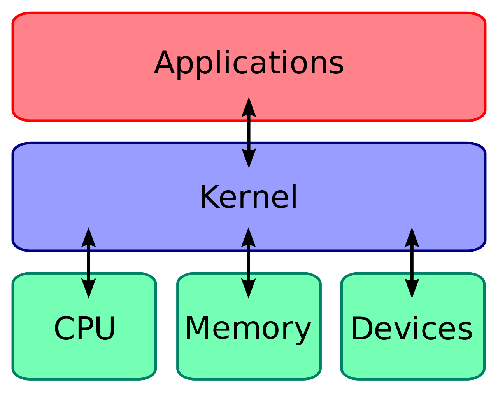
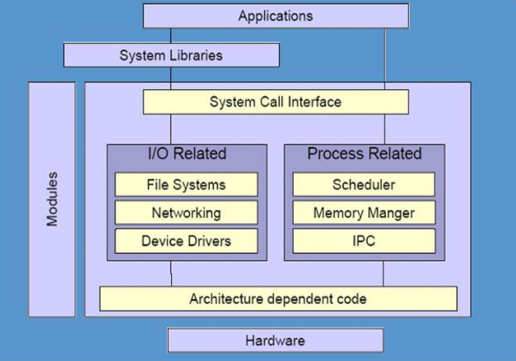
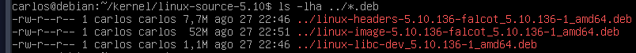
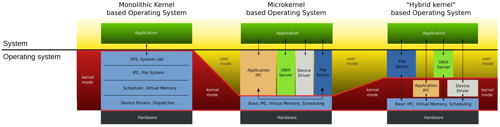

# Kernel

## Qué es el kernel

Es el **software** que se encarga de **interconectar el hardware de una computadora y las aplicaciones**, en otras palabras, se encarga de **administrar los recursos de la máquina y administrar los procesos**.

> **Nota** Esta capa es el software de más bajo nivel en una computadora.



Gracias a esta capa de software (*kernel*), las aplicaciones pueden ejecutarse **independientemente del hardware subyacente**, ya que se comunican con el kernel y no con el hardware directamente. 

> **Nota** Técnicamente Linux es el kernel y no el Sistema Operativo.

El kernel de Linux está ubicado en `/boot/vmlinuz-<version>`, básicamente es un archivo imagen comprimido.

```bash
$ file /boot/vmlinuz-5.10.0-16-amd64 
# /boot/vmlinuz-5.10.0-16-amd64: Linux kernel x86 boot executable bzImage, version 5.10.0-16-amd64 ...
```

### Funciones principales del kernel

Se pueden resumir en 4 áreas generales del sistema:

1. A nivel de **procesos**, el *kernel* es el responsable de determinar que procesos harán uso de la CPU y por cuanto tiempo, también es el encargado de arrancar y parar procesos, conocer su estado actual.

   >A grandes rasgos, un proceso es un programa en ejecución.

2. A nivel de **memoria**, el *kernel* se encarga de “particionar” la memoria para los distintos procesos, crear áreas de memoria compartida, gestionar los accesos a memoria, conocer la ubicación de los procesos, etc.

3. **Drivers de dispositivos**, el *kernel* requiere de drivers para acceder al hardware (ya sea un disco, interfaz de red, acceso a usb, etc.) y poder manipularlos. 

   > En resumen, administra los periféricos conectados (discos, teclado, monitor, etc.)

4. **Llamada al sistema** (*System calls*) - Son operaciones específicas que los programas utilizan para acceder a las funcionalidades del kernel. p.e. para abrir un fichero de texto.

> Ref.: How Linux Work 3ed, pg 34

### Modos de ejecución de los procesos

Los procesadores modernos, por lo general, proveen dos modos de ejecución para los procesos: *user mode* y *kernel mode*.

- Los *procesos de usuario* se ejecutan en ***user mode***, en este modo los procesos tiene acceso restringido y limitado a la memoria y CPU. Por lo tanto requieren de *llamadas al sistema* para accederlos.

  > **Recordar**: Los procesos de usuario (librerías, programas, etc. en ejecución) residen en el espacio de usuario.

- El *kernel y sus procesos* se ejecutan en ***kernel mode*** y tienen acceso ilimitado a la  CPU y la memoria. Este modo es muy crítico si no se cuenta con las medidas de seguridad.

  > **Importante**: Descargar el kernel de sitios oficiales.


### Llamadas al sistema (system calls or syscalls)

Es una interfaz que provee el *kernel* para comunicarse con los procesos de usuario. Por lo tanto es una de las funcionalidades más importantes.

Cuando un proceso de usuario requiere una tarea que solo el *kernel* lo puede hacer (p.e. abrir un archivo), hace uso de las ***llamadas al sistema***, ya que el *kernel* es el controla los sistemas de fichero, acceso al disco, etc.

Los **lenguajes de programación**, por lo general cuentan con ***librerías estándar*** que se encargan de realizar las *llamadas al sistema*.

Por ejemplo, para abrir un fichero en python se usa la función `open()`, que en el fondo realiza una *llamada al sistema* para realizar esta operación. (Ref. [Librerias vs llamadas al sistema](https://es.stackoverflow.com/questions/229354/librerias-vs-llamadas-al-sistema))

> **Nota**: *Llamada al sistema* NO es ejecutar comandos en una shell

## Arquitectura del Kernel de Linux

El kernel de linux está **compuesto por módulos**, cada módulo se encarga de tareas específicas, como:

- Gestión de procesos
- Gestión el sistema de archivos
- Gestión de memoria
- Gestión de periféricos de Entrada/Salida
- Interfaz de llamadas al sistema



> **IPC** - Interprocess communication code. En simple es un módulo para la comunicación entre procesos.

### Módulos del kernel de Linux

El kernel de Linux está compuesto por miles de módulos de los cuales solo algunos se cargan en el arranque del sistema y otros se cargarán cuando sea necesario solamente.

1. Los módulos que se cargan en el arranque están **activos todo el tiempo**,  por lo general son módulos "esenciales" que tienen un **uso frecuente**, estos se denominan ***módulos estáticos*** porque **forman parte de la imagen del *kernel*** (`/boot/vmlinuz-<version>`) <!-- Por ejemplo: EL MODULO DEL SISTEMA DE ARCHIVO O INTERFAZ DE RED (BUSCAR SUS NOMBRES)-->

2. Los **módulos enlazados dinámicamente** (también conocidos como LKM), son módulos que se cargan solo cuando son requeridos. por ejemplo: *drivers de sonido*
   Estos módulos se encuentran en el directorio `/lib/modules/<version>/kernel/` y tienen extensión ***.ko*** (*file kernel object*)

   ```bash
   # Ver la cantidad de módulos enlazados dinámicamente.
   find /lib/modules/5.10.0-16-amd64/kernel/ -name "*.ko" | wc -l
   # 3899
   ```

### Manipulación de módulos

> VER EL VIDEO Manejo de módulos de kernel, ahi muestra ejemplos básicos.

Ver los módulos en uso actualmente en la máquina: `lsmod`

```bash
$ lsmod
Module                  Size  Used by
...
snd_usbmidi_lib        45056  1 snd_usb_audio
snd_rawmidi            53248  1 snd_usbmidi_lib
hid_generic            16384  0
usbhid                 65536  0
hid                   159744  2 usbhid,hid_generic
fat                    90112  2 msdos,vfat
```

## Linux Kernel releases  

La última versión a la fecha (05-2023) es: 6.3.2 

> verificar en www.kernel.org

Existen 4 principales categorías

- **Prepatch** -  o "RC" son versiones preliminares del kernel, contienen nuevas características que deben ser probadas antes de pasar a la versión stable.
- **Mainline** - se encuentran las principales actualizaciones y nuevas características, se lanzan cada 2 a 3 meses.
- **Stable** - Después de lanzarse el *mainline*, este se considera estable. Las correcciónes de errores se traen del *mainline*.
- **Longterm** - son versiones que se designan como "mantenimiento de largo plazo" para quienes no actualizan su kernel. Solo se hacen correcciones de errores importantes.

En la práctica muchas distribuciones **proporcionan sus propios kernels** (Longterm), así mismo **ponen a disposición actualizaciones propias del kernel** que no se obtienen desde *kernel.org* y que son soportados por sus propios desarrolladores.

### Verificar la versión del kernel instalado

```bash
uname -r
## 6.1.0-21-amd64
```

- If you see anything at all after the dash, you are running a distribution kernel. El ejemplo es un kernel de Debian para procesadores x86 de 64bits 

## Código fuente del Kernel de Linux

El sitio oficial para descargar el código fuente es: www.kernel.org

Otra opción es usar el comando `wget` para descargarlo.

```bash
$ wget https://kernel.org/pub/linux/kernel/v5.x/linux-5.10.62.tar.xz

$ wget https://kernel.org/pub/linux/kernel/v5.x/linux-5.10.62.tar.sign

$ unxz -c linux-5.10.62.tar.xz | gpg --verify linux-5.10.62.tar.sign -
```

- El link cambia dependiendo de la versión, revisar **todas las versiones** en: https://kernel.org/pub/linux/kernel/

> **Nota**: Repositorio Github de Linux: https://github.com/torvalds/linux, no es usual descargarlo de aquí

### Estructura de ficheros del código fuente

- `arch`: Contiene las estructuras para manejar un procesador.

- `drivers`: Cada periférico tiene su archivo asociado y se accede a traves de `/dev/xxx`

- `fs`: Algunos periféricos se montan como sistema de archivos dependiendo del tipo de dispositivo, cada uno de ellos tiene un directorio a partir de aquí.

- `include`: Contiene todos los ficheros de cabecera que se necesitan para la compilación.

- `init`: Hay ficheros que se ejecutan durante el arranque.

- `ipc`: Contiene los fuentes para la comunicación entre procesos.

- `kernel`: Aquí estan las rutinas más comunes que realizan los procesos.

- `lib`: Aquí están los ficheron que se llaman desde cualquier parte del kernel.

- `mm`: Rutinas asociadas a la gestión de memoria e intercambio de procesos.

- `modules`: Una vez compilado se depositarán los módulos construidos.

## Compilar el kernel de Linux <!--falta completar-->

PASOS GENERICOS PARA COMPILAR EL KERNEL

- https://kernel-team.pages.debian.net/kernel-handbook/ch-common-tasks.html#s-kernel-org-package
- VER VIDEO 
- Según su pagina todos los requerimientos mínimos para compilar el kernel https://docs.kernel.org/process/changes.html
- https://docs.kernel.org/admin-guide/README.html

### Compilar un módulo que no se incluye en el kernel

- https://kernel-team.pages.debian.net/kernel-handbook/ch-common-tasks.html#s-common-out-of-tree

## Kernel Debian

**Debian** proporciona su propio kernel (modificado del kernel original)

Maneja varias versiones: stable, unstable, testing, entre otras más (https://tracker.debian.org/linux). 

> El repositorio Git del código fuente es: https://salsa.debian.org/kernel-team/linux

### Actualizar el kernel

APT es capaz de actualizar el kernel, simplemente actualizando dos paquetes:

> Verificar la versión del *kernel* actual `uname -r`

```bash
sudo apt update

## Esto es solo para PCs 64-bit
sudo apt install linux-image-amd64 linux-headers-amd64

sudo reboot
```

- Para otras arquitecturas, buscar la versión adecuada ejecutando: `apt search ^linux-image`

> **Nota**: Para instalar *kernels* más actuales de la versión estable, se puede añadir entradas en `/etc/apt/source.list` correspondientes a la distribución Unstable de Debian
>
> ```
> ### --> /etc/apt/source.list
> deb http://ftp.br.debian.org/debian/ unstable main
> deb-src http://ftp.br.debian.org/debian/ unstable main
> ```
>
> Estos *kernels* no se recomienda para un uso en producción ya que no están totalmente probados por otra parte la ventaja es que traen nuevas actualizaciones.

#### Instalar una versión específica

```bash
## verificar la versión actual
uname -r
# 6.1.0-11-amd64

sudo apt update

## Listar las versiones disponibles 
apt search ^linux-image-[0-9]+.[0-9]+.[0-9\-]*-amd64$
# linux-image-5.10.0-20-amd64/... 
# linux-image-6.1.0-11-amd64/... [installed]
# linux-image-6.1.0-21-amd64/...
# ...

## Instalar el kernel (p.e. 6.1.0-21-amd64)
sudo apt install linux-image-6.1.0-21-amd64 \
linux-headers-6.1.0-21-amd64
```

> **Investigar** Para que sirven los kernel tipo "rt", "686" y los "cloud"?

### Compilar un kernel Debian personalizado

El kernel proporcionado por Debian viene incluido con la mayor cantidad de módulos para cubrir un espectro muy amplio de hardware. Es por ello que algunos usuarios prefieren re-compilar el kernel e incluir solo lo necesario, esto tiene la ventaja de:

+  Optimizar el uso de memoria.
+  Reducir el riesgo de problemas de seguridad.

#### 1. Instalar las herramientas necesarias

Instalar los siguientes paquetes para poder compilar el kernel:

+ `build-essential`
+ `libncurses-dev`(anteriormente *libncurses5-dev*)
+ `fakeroot`
+ además, `dpkg-dev`, `rsync`, `libelf-dev`, `libssl-dev` (según lo practicado)

#### 2. Obtener el código fuente del kernel

1. En Debian se puede descargar la fuente del kernel *como si fuese un paquete* a través de la herramienta `apt`

   ```bash
   # Buscar kernels disponibles
   apt search ^linux-source
   
   # descargar el kernel
   apt install linux-source-<version-kernel>
   
   # Verificar la descarga del código fuente (archivo .tar.xz)
   ls -l /usr/src/
   ```

   - `apt`  descargará el código fuente del kernel en: `/usr/src/<version-kernel>`

   > **Nota**: Para obtener *kernels* que no han sido lanzados aun, añadir entradas en `/etc/apt/source.list` correspondientes a la distribución *Unstable* de Debian
   >
   > ```
   > deb http://ftp.br.debian.org/debian/ unstable main
   > deb-src http://ftp.br.debian.org/debian/ unstable main
   > ```
   >
   > Estos *kernels* **no se recomienda** para un uso en producción ya que no están totalmente probados por otra parte la ventaja es que traen nuevas actualizaciones.

2. Extraer el archivo comprimido en un nuevo directorio, por ejemplo: `~/kernel`.

   ```bash
   mkdir ~/kernel; cd ~/kernel
   tar -xavf /usr/src/linux-source-<version>
   ```

   - Se puede ejecutar como usuario normal

#### 3. Archivo de configuración del *kernel*

Antes de compilar el *kernel*, es necesarios crear el archivo `.config` el cual indica qué módulos se van a incluir en el *kernel* además de otras opciones. 

Este archivo se debe ubicar dentro del directorio del código fuente del kernel que se descomprimió anteriormente (en el ejemplo: `~/kernel/linux-source-<version>/`).

La estructura de este archivo es de CLAVE=valor (si el valor tienen espacios, incluir las comillas).

- Si el módulo se incluirá como LKM, el valor será `m`, 
- Si se va a incluir como módulo estático (dentro de la imagen del kernel), será `y` 
- en caso de no incluir el módulo, será `n` o comentar la linea con `#`.

- Ademas de otros lores pero no hacen referencia a los módulos.

> **Nota**: La configuración de este archivo no se lo suele hacer editando directamente, sino a través de una interfaz (linea de comandos o GUI)

- Copiar el archivo de configuración actual:

  ```bash
  cp /boot/config-`uname -r` ~/kernel/linux-source-<version>/.config
  
  ## (opcionalemente) actualizar las entradas de .config
  ## si el kernel es una nueva versión
  cd ~/kernel/linux-source-5.10/
  make olddefconfig
  ```

- Ajustar las configuraciones para el kernel nuevo

  ```bash
  cd ~/kernel/linux-source-<version>/
  make <conf-target>
  ```

  - `olddefconfig`  define las nuevas opciones con valores por defecto.

  - `menuconfig` abre una interfaz en linea de comandos para editar los valores de `.config`

    - marcar con `M` para incluir el módulo *enlazado dinámicamente*
    - `Y` para indicar que el módulo se incluirá en la imagen del kernel.
    - o **desmarcar** para no incluirlo.

    Más info en: [Configuring the Kernel](https://debian-handbook.info/browse/stable/sect.kernel-compilation.html#sect.config-kernel)

  - `localmodconfig` actualiza el `.config`  deshabilitando los módulos no cargados en el sistema. Es decir, seleccionan automáticamente los módulos que están en uso en la máquina (Este kernel es muy probable que solo funcione en la máquina actual, NO serviría para otras computadoras).

  - Existen otros más como `make xconfig` ver detalles `make help` o [aquí](https://docs.kernel.org/admin-guide/README.html#configuring-the-kernel)

  > **Recomendación**: usar la opción `olddefconfig` si no se quiere hacer cambios radicales a la configuración actual del *kernel* (según lo practicado).
  >
  > Para optimizar (LOC-OS sugiere) usar la opción `localmodconfig` y luego la opción `menuconfig` para afinar las configuraciones.

- (Opcional) Verificar el archivo `.conf`:

  + Ver los cambios: `diff .conf /boot/config-<version>`

  + Cant. de módulos que serán enlazados dinámicamente: `grep '=m' .config | wl -l` 

  + Cant. de módulos que serán parte de la imagen del kernel: `grep '=y' .config | wl -l`

> **Nota**: En este texto hay una guía de como elegir los módulos manualmente, es algo antiguo pero útil "*Cómo compilar el kernel Linux - Guillermo Valdez Lozano (2007)*"

#### 4. Compilar y Construir el paquete

Luego de configurar, ejecutar el siguiente comando (dentro el directorio del código fuente):

```bash
make -j 'nproc' deb-pkg LOCALVERSION=-falcot KDEB_PKGVERSION=$(make kernelversion)-1
```

- La opción `deb-pkg`, indica que se **compilará kernel en un paquetes *.deb***.

  > Alternativamente se puede reemplazar con `bindeb-pkg`
  >
  > - deb-pkg             - Build both source and binary deb kernel packages
  > - bindeb-pkg         - Build only the binary kernel deb package

- Se recomienda usar la opción `-j <#>` indica el número de núcleos de procesador a usarse.

- `KDEB_PKGVERSION` define la versión numérica (opcional).

- `LOCALVERSION` define el nombre de la versión (opcional).

> **NOTAS ADICIONALES**
>
> **Nota 1**: Puede demorar muchas horas (8hrs en mis pruebas) si se usa un solo *core*. **deshabilitar la información del *debug*** puede reducir el tiempo.
>
> ```
> ### ---> .config
> ...
> CONFIG_DEBUG_INFO=n   <-- quedando así
> ```
>
> ---
>
> **Nota 2**: Se va a generar el error ***"Missing debian/certs/debian-uefi-certs.pem"*** porque la configuración por defecto es
>
> ```
> ### ---> .config
> ...
> CONFIG_SYSTEM_TRUSTED_KEYS="debian/certs/debian-uefi-certs.pem"
> ```
>
> dicho archivo no existe, para solucionar:
>
> - Descargar el archivo del repositorio Git https://salsa.debian.org/kernel-team/linux y colocarlo dentro del directorio `linux-source-<version>/` respetando la ruta.
> - Reemplazar por su propio certificado
> - o Deshabilitar el certificado `CONFIG_SYSTEM_TRUSTED_KEYS=""` 

Al terminar se crearán 5 archivos:

- **linux-image-version**: contains the kernel image and the associated modules,
- **linux-headers-version**: contains the header files required to build external modules
- **linux-libc-dev** contains headers relevant to some user-space libraries like GNU glibc.
- **linux-firmware-image-version**: este paquete **puede faltar** si se construye desde la fuente del kernel proporcionada por Debian.
- **linux-image-version-dbg**:  only created if `CONFIG_DEBUG_INFO=y`

```bash
ls ../*.deb
```



#### 5. Instalar el kernel compilado

Debido que el resultado fueron paquetes *.deb*, la manera más fácil de instalar es utilizando la herramienta `dpkg`.

```bash
sudo dpkg -i linux-image-<version>.deb

sudo reboot
```

## Parches (kernel patch)

Es un archivo que contiene características adicionales que no están incluidas en la versión estándar del kernel.

Estos pueden ser o no proporcionados por las distribuciones de Linux, en caso de obtener parches de terceros verificar su procedencia por temas de seguridad ya que estos parches se incluirán en el kernel.

### Aplicar un Kernel Patch

Debian a veces proporciona parches como paquetes `linux-patch-*` (a menudo no disponible en versiones estables), estos se descargan en `/usr/src/kernel-patches/` 

Proceso para aplicar un parche:

```bash
# Ubicarse en el directorio de la fuente del kernel
cd ~/kernel/linux-source-4.9
make clean

# Usar el comando patch para aplicar el/los parches
zcat /usr/src/kernel-patches/diffs/grsecurity2/grsecurity-3.1-4.9.11-201702181444.patch.gz | patch -p1

## Continuar con los pasos de compilación
```

No todos los parches funcionan en todos las versiones de kernel. Pueden fallar su instalación, en esos casos buscar documentación en */usr/share/doc/linux-patch-\**. 

>**NOTAS**
>
>[Aquí hay un enlace a los parches del kernel de Debian](https://salsa.debian.org/kernel-team/linux/tree/master/debian/patches) . 
>
>Un ejemplo es ["ovl: permitir montajes overlayfs en espacios de nombres de usuario (núcleo corrupto)"](https://salsa.debian.org/kernel-team/linux/blob/master/debian/patches/debian/overlayfs-permit-mounts-in-userns.patch) . Esto permite el uso de overlayfs,
>
>Ref.:https://www.reddit.com/r/debian/comments/ai618b/what_are_the_debian_kernel_patches/

## Referencias

- Website Linux kernel: https://www.kernel.org/
- Releases Linux Kernel: https://www.kernel.org/category/releases.html
- Debian - Compilar kernel: https://debian-handbook.info/browse/stable/sect.kernel-compilation.html
- Debian - Instalación del kernel https://debian-handbook.info/browse/stable/sect.kernel-installation.html
- Debian Kernel - Package Status: https://wiki.debian.org/DebianKernel
- Apuntes kernel - fisop: https://fisop.github.io/apunte/kernel.html
- Building a custom kernel from the "pristine" kernel source https://kernel-team.pages.debian.net/kernel-handbook/ch-common-tasks.html#s-kernel-org-package
- Rebuilding official Debian kernel packages https://kernel-team.pages.debian.net/kernel-handbook/ch-common-tasks.html#s-common-official
- Instalar Kernel en Loc-OS y Debian https://www.youtube.com/watch?v=Pbc3x6MUbMw&t=202s
- Compilar Kernel Linux optimizado y fácil https://www.youtube.com/watch?v=YNo9ereeao4&t=268s

- Configuring the kernel https://docs.kernel.org/admin-guide/README.html#configuring-the-kernel
- Applying a Kernel Patch https://debian-handbook.info/browse/stable/sect.kernel-compilation.html#sect.kernel-patch

---------------------------------------

## Extra

### Archivos principales para el arranque de Linux

Estos se ubican en el directorio `/boot/`:

- `vmlinuz-5.10.0-16-amd64` es el archivo del kernel.
- `initrd.img-5.10.0-16-amd64` es como una pequeña RAM que se utiliza durante el arranque para acceder al dispositivo que tiene la partición raíz.
- `System.map-5.10.0-16-amd64` Se utiliza para la gestión de la memoria antes de ejecutar el archivo del kernel.
- `config-5.10.0-16-amd64` Están definidas las opciones y módulos que se cargarán al arranque del sistema. 

> `initramfs` es el sucesor de **initrd**. fuente: https://debian-handbook.info/browse/stable/sect.kernel-installation.html

### Tipos de kernel

**Microkernel**

Sólo administra lo esencial como el CPU y memoria ( se ejecuta en modo kernel), todo lo demás es tratado como complemento (se ejecuta en modo usuario), 

**Pros**: Tiene un tamaño muy pequeño.

**Contra**: Algunos módulos, como los controladores, se ejecutan modo usuario lo que ocasiona que sea lento en responder.

Ejemplos: QNX y MINIX.

**Monolítico**

Concentra todas las funcionalidades (planificación, sistema de archivos, controladores, etc.) y los ejecuta en modo kernel. 

Contra: Puede tener un tamaño relativamente grande.

Pros: Todos los módulos tienen acceso a la estructura de datos interna y rutinas, por lo tanto es mas rápido la comunicación entre si, pero un error en una rutina puede causar la caída total.

> Para añadir una nueva funcionalidad se debe recompilar completamente.

Ejemplos: Linux, Unix y Windows NT.

**Híbrido**

Tienen la capacidad de elegir que módulos se desea ejecutar en modo kernel o modo usuario.

Ejemplos: Windows y macOS



#### ¿Qué tipo de kernel es Linux?

Tiene un diseño monolítico porque es un único programa ejecutándose, sin embargo con el tiempo ha adquirido un diseño modular, por lo que, se puede añadir características al kernel en tiempo de ejecución.
