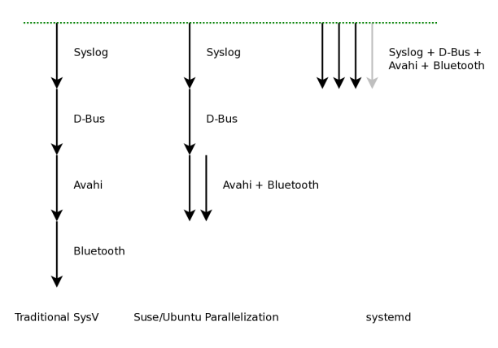

# Programa init

> **Tarea previa**: 
>
> - ¿Que son los procesos? ¿Que son los servicios y demonios? 
>
>   *A process is the representation in memory of a running program. A single program may be instantiated nto several processes* (Hertzog, pg. 199)
>
> - Que es D-Bus?
>
> - Que es Avahi
>
> - que es syslogd?

Recordando la secuencia de arranque del sistema, en resumen, es:

```
BIOS+MBR | UEFI
Bootloader
Linux Kernel
	Drivers y filesystem root /
init (PID 1)
	udev, servicio de red y otros mas
```

> **Nota**: Algunos libros utilizan los términos *init, init system or boot system* para referirse al programa *init*.


En sistemas Unix, existe un programa especial llamado *init* que se ejecuta después de (cargarse) kernel y que tiene como PID 1, es decir, que *init* seria el primer proceso (del user-space) en ejecutarse.

>"La responsabilidad central de un sistema init es mostrar el
>*espacio de usuario.*" [Pid Eins](http://0pointer.de/blog/projects/systemd.html)

La función principal del *programa init* es cargar el resto del sistema y administrar los servicios (iniciar, detener, conocer su estado). 

>User space starts in roughly this order (Ward, pg 200):
>1. init
>2. Essential low-level services, such as udevd and syslogd
>3. Network configuration
>4. Mid- and high-level services (cron, printing, and so on)
>5. Login prompts, GUIs, and high-level applications, such as web servers


El programa *Init*  se encuentra en `/sbin/init` 

```bash
ls -l /sbin/init 
lrwxrwxrwx ... /sbin/init -> /lib/systemd/systemd
```

## Tipos de init

Existen varias programas init, entre los más usados están:

- **System V init (Sys V o sysvinit)** - Es un sistema de arranque antiguo que se usaba en la mayoría de las distribuciones Linux. Su lógica de arranque se basa en una serie de scripts (`/bin/bash` o cualquier otro shell) que se ejecutan secuencialmente (*arranque secuencial*). En Debian estuvo presente hasta la versión (8) "Wheezy".

  > **Los servicios arrancan uno tras otro**, la ventaja de esto es que no tiene complicaciones con sus dependencias (ya que al ser secuencial, primero se cargan los que no tienen dependencias y posteriormente los que dependen de los que ya se han cargado) pero el rendimiento se ve afectado.

- **Systemd** - Es un estándar emergente, tiene mejor rendimiento porque es capaz de arrancar varios servicios al mismo tiempo, pero resolver las dependencias es mas complejo. En Debian se convirtió por defecto desde la versión (9) *"Jessie"*.

- **Upstart** - Fue creado por Ubuntu pero no lograron que sea un estándar, este *init* estuvo por defecto hasta la version 15 de Ubuntu pero en versiones posteriores fue reemplazado por *systemd*. 

  > "Upstart está basado en eventos" (al parecer significa que los scripts se ejecutan en respuesta a eventos, aun así es una definición no muy clara, quizás seria buscar algo mas de info).
  >
  > El inicio y la detención de procesos están vinculados a "eventos" que suceden en el sistema, donde un "evento" puede ser muchas cosas diferentes, como: una interfaz de red está disponible o algún otro se ha iniciado el software. [Pid Eins](http://0pointer.de/blog/projects/systemd.html)




### ¿Cómo identificar el *programa init* que tenemos instalado?

- Si se tiene los directorios `/usr/lib/systemd` y `/etc/systemd/` entonces se tiene instalado Systemd.
- Si se tiene `/etc/inittab` entones de tiene instalado System V init
- De manera estándar, ejecutar `man init` (***Recomendado***)

## Runlevels de System V

Los niveles de ejecución (o runlevels) son parte del antiguo "System V Init".

Un sistema Linux puede estar en algún estado en un momento determinado. p.e. cuando arrancamos el sistema (este llegará a un estado).

Cada estado tiene asociado un conjunto de procesos en ejecución, demonios o servicios (como crond y udevd).

En *System V* cada estados se denominan **runlevel**, y se enumeran del 0 al 6

> En resumen: Los *runlevels* son estados que la máquina puede alcanzar (p.e. arranque del sistema), existen *7 runlevels* (que van del 0 al 6). Cada *runlevel* tiene asociado procesos y servicios (como crond y udevd) que se ejecutan a través de *scripts* en el arranque del sistema.

> Cada distro ha implementado los *runlevels* a su manera. sin embargo lo más común es mas o menos así:

| Runlevel | Estado                  | Descripción                                                  |
| -------- | ----------------------- | ------------------------------------------------------------ |
| 0        | Halt                    | Apaga el sistema                                             |
| 1        | Single-user             | **Modo de recuperación**. Solo está disponible el root y el sistema de archivos. *GRUB suele permitir iniciar en este modo.* |
| 2        | Multi-user              | Multiusuario sin soporte de red.                             |
| 3        | Multi-user + networking | Igual que el 2 pero con soporte de red.                      |
| 4        | No tiene uso            | Depende de la distro.                                        |
| 5        | Multi-user + GUI        | Igual que el 3 pero con entorno gráfico.                     |
| 6        | Reboot                  | Reinicia el sistema                                          |

Lo mas común para usuarios normales es trabajar en *runlevel 5*.

> **Nota**: En Debian uses four different runlevels: level 0 (apagado del sistema), level 1, (single-user, servicios básicos para realizar operaciones de mantenimiento), level 2 (modo normal, incluye servicio de red, GUI, user login, etc.) y level 6 (reboot).
>
> Other levels exist, especially 3 to 5. By default they are configured to operate the same way as level 2, but the administrator can modify them según sus necesidades. (Hertzog, pg 205, 9.1.2. The System V init system).

### ¿Cómo conocer el nivel de ejecución actual?

Ejecutando `runlevel` o `who -r`

```bash
$ who -r
run-level 5 2019-01-27 16:43
### fecha y hora que se estableció el *runlevel*
```

### Directorios de runlevels

Cada runlevel tiene un directorio: `/etc/rc*`

```bash
carlos@debian:~$ ls -d /etc/rc*
/etc/rc0.d  /etc/rc2.d  /etc/rc4.d  /etc/rc6.d
/etc/rc1.d  /etc/rc3.d  /etc/rc5.d  /etc/rcS.d
```

Donde cada directorio pertenece a un runlevel específico, p.e. el directorio `/etc/rc5.d/` pertenece al **runlevel 5**, `rc2.d` corresponderá al *runlevel 2* y así sucesivamente.


>**Tarea**: ¿Que función tiene el directorio `/etc/rcS.d`?


Cada directorio `/etc/rc*` contiene (en su mayoría) enlaces simbólicos que apuntan a scripts (de servicios) del directorio `/etc/init.d/`.

```bash
ls /etc/rc5.d/
S01bluetooth -> ../init.d/bluetooth
S10sysklogd
...
S89cron
S99sshd
```

> `rc` significa *run commands*, como *scripts, programas o servicios* (Hard, pg 228)

#### Formato de nombres de archivo

Todo los nombres de archivos de estos directorios, están en un formato: `<K|S>nn<nombre-proceso>`

Donde:

- `K` (kill) - El servicio se detiene al entrar al runlevel
- `S` (start) - El servicio **se ejecutará** al entrar al runlevel
- `nn` - un numero de dos dígitos, **indica la prioridad** (determina la "secuencia"), más bajo el número mayor prioridad.

> Si dos scripts tienen el mismo número, el orden se define por orden alfabético.

por ejemplo: `S01bluetooth` ... `S99sshd`, se ejecutarán en esa secuencia.

> **¿Que pasa si hay archivos que empiezan con K y S en el mismo directorio?** 
>
> R. No encontré (tampoco busqué) en los libros que estoy leyendo, este caso. Pero deduzco por lógica que primero se ejecuta los que empiezan con K y luego los con S. Pero independientemente de cual se ejecute primero (K o S) no creo que haya el mismo servicio con K y S en el mismo, eso seria una inconsistencia.

---

A pesar de que los *runlevels* son parte del pasado, *systemd* mantiene compatibilidad simplemente para arrancar servicios que funcionan solo con scripts de *System V Init*.

## System V

System V lanza los demonios o servicios mediante scripts (comandos bash).

> La lógica de arranque clásica de sysvinit se basa en scripts de shell
>
> <!--EN EL LIBRO LINUX-INTERNAL PG 285 ESTA YA RESALTADO. NOSE SI VALE LA PENA AUMENTAR ACA ¿¿?¿ ? DECIDELO TU.-->

<!--HAY Informacion resumida en The Debian Administrator's Handbook, pg 204, 9.1.2. The System V init system--> 

<!--El del libro How Linux Work 3ed, también esta entendible pero tiene algunas otras cosas mas que explica, pg. 226,  6.5 System V init--> 

<!--ALGUN DIA QUE TENGA TIEMPO VOY A LLENAR ESTA PARTE-->

>System V init is now uncommon on most server and desktop installations, but you may encounter it in versions of RHEL prior to version 7.0, as well as in embedded Linux environments, such as routers and phones. (How Linux Work, pg 226)

para cambiarse de runlevel `telinit 3`

---

### Interactuar con los servicios y demonios

Una vez que los servicios han sido instalados, podemos interactuar con ellos mediante las opciones start, stop, status y en algunos casos restart.

Ejemplo:

```bash
/etc/init.d/apache2 start
/etc/init.d/apache2 stop
/etc/init.d/apache2 status
/etc/init.d/apache2 restart
```

### Comando service

Según investigué, el comando `service` es parte de Sys V y se usa para iniciar o detener servicios:

```bash
service stop sshd
```

Las opciones son: `start`, `stop`, `status`, `restart`, `reload` dependiendo si el servicio lo permite.

> En S.O. con *systemd* es posible usar este comando, tiene la misma compatibilidad al igual que los runlevels.

Una opción muy útil es `service --status-all`, muestra "en corto" los servicios que están activos o no. 

> !*Probado en Debian*!  


## Systemd

<!--Seria hacer un resumen pequeño de lo mas importante systemd-->


## Usar shell como init

Using a shell as init to
gain root rights The Debian adm handbook pg 200


## Referencias

Hertzog - The Debian Administrator’s Handbook (Buster)

Ward - HOW LINUX WORKS 3rd Ed 2021