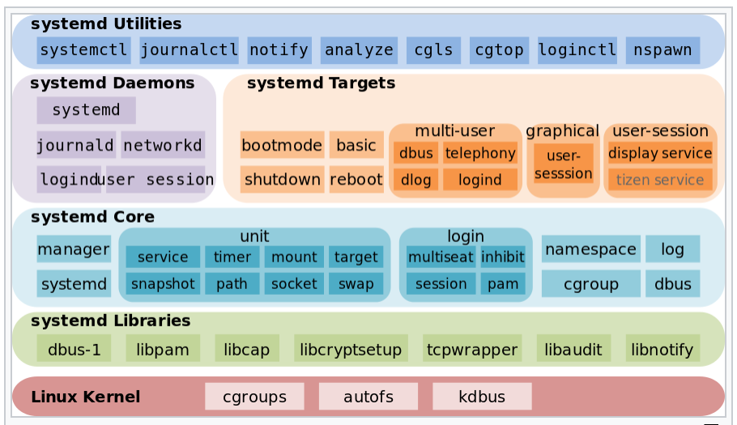
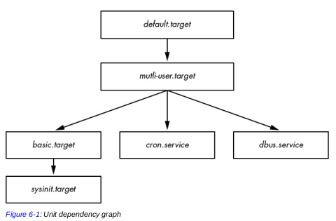

# Systemd

> Tarea: ¿Que es activación de sockets y D-bus?
>
> ¿Que es demonio y servicio?

*Systemd* es el *programa init* más utilizado actualmente en distribuciones GNU/Linux, Su principal tarea es arrancar y administrar el sistema y los servicios.

> Como *systemd* es un programa init, por ende se ejecuta como **PID 1**.

Su principal ventaja como sistema de arranque, es que puede iniciar servicios en paralelo (mediante la activación de sockets y D-bus, *mas info en [Pid Eins](http://0pointer.de/blog/projects/systemd.html)*) de manera que el inicio del sistema es más rápido.


Systemd no solo es un *init system* sino que, ademas proporciona otras funcionalidades como inicio de demonios bajo demanda, realiza seguimiento de los procesos mediante *cgroup*, mantiene puntos de montaje y automontaje, monitorea y administra la red.

> cgroup (control de grupos) - Básicamente permiten la creación de una jerarquía de grupos de procesos. Si un proceso que pertenece a un cgroup específico se bifurca, su hijo se convertirá en miembro del mismo grupo. cgroup ademas permite limitar el uso de CPU y memoria a los grupos.

Other parts include a logging daemon, utilities to control basic system configuration like the hostname, date, locale, maintain a list of logged-in users.  [what is this?](https://www.freedesktop.org/wiki/Software/systemd/)



## Units

Las funcionalidades (o componentes) de *systemd* se basan en la noción (o concepto) de *units*, cada *unit*  tiene asociado un archivo de configuración que lo describe (puede contener el tipo, dependencias, demonios que ejecutará, etc.).

Por ejemplo, el *archivo unit* del servicio ssh: 

```bash
# /usr/lib/systemd/system/ssh.service
[Unit]
Description=OpenBSD Secure Shell server
After=network.target auditd.service
ConditionPathExists=!/etc/ssh/sshd_not_to_be_run

[Service]
EnvironmentFile=-/etc/default/ssh
ExecStart=/usr/sbin/sshd -D $SSHD_OPTS
```

### Tipos de *units*

Existen una variedad de tipos, pero los mas conocidos son:

- **Service** (servicio) - Esta *unit* controla los servicios (inicia, detiene, etc.). Ademas se encarga de mostrar informes de progreso, realizar un seguimiento de los procesos e incluso reiniciarlos cuando sea necesario. (En este documento nos enfocaremos en este tipo).

  > **Nota**: Systemd también puede leer configuraciones de servicios, desde los scripts de Sys V (`/etc/init.d/`).

- **Target** (objetivo) - Es una unit especial, su "objetivo" es alcanzar un estado (similar a los runlevels, pero no exactamente). Básicamente agrupa varias *units* para alcanzar su objetivo, (Es posible que un *target* contenga a otros *target*).

  > Por ejemplo, el `defautl.target` básicamente hace los mismo que el runlevel 5 o `bluetooth.target` tiene servicios relacionados con bluetooth <!--(Lo revise pero no encontré una linea que haga referencia al servicio bluetooth)-->

- **Mount** (montaje) - Controla el montaje (y desmontaje) de sistemas de archivos. 

  > El archivo `/etc/fstab` se usa como una fuente adicional de configuración para puntos de montaje tal a como funciona en Sys V.

- **Device** (dispositivo) - this unit encapsulates a device in the Linux device tree.

  > If a device is marked for this via udev rules, it will be exposed as a `device` unit in systemd

> Nota: La lista completa se encuentra en el manual `man systemd`

### Arranque y las dependencias de units

Cuando el S.O. arranca, se activa el *unit* predeterminado, `default.target`, el cual agrupa otros tipos de *units* (*target*, *services* y *mount*) los cuales son sus dependencias.



>*Figure 6-1 shows a very small part of the **dependency graph** for the*
>*default.target unit found on a typical system*
>
>Se puede usar el comando `systemd-analyze dot | dot -Tsvg > systemd.svg` para generar el verdadero grafo de dependencias de las units. (Lleva mucho tiempo)

> **Nota**: por lo general, el default.target es un enlace simbólico a otro:
>
> ```bash
> ls -l /usr/lib/systemd/system/default.target 
> lrwxrwxrwx ... /usr/lib/systemd/system/default.target -> graphical.target
> ```


Otro ejemplo: un *device* puede depender de un *service*, cuando un dispositivo esté disponible el servicio iniciará. <!--Me parece contradictorio pero eso es lo que dice el libro--> Los *mount* dependen implícitamente de los *device* (desde son montados) o incluso puede que de otro *mount*, p.e. el mount `/home/lennart` puede que dependa del mount `/home` [Pid Eins](http://0pointer.de/blog/projects/systemd.html)

## Configuración de systemd

Los archivos de configuración se encuentran principalmente en dos directorios:

- `/usr/lib/systemd/system/` configuraciones de los *units* (Conf. global).
- `/etc/systemd/system/` configuraciones de systemd (Conf. local)

> **Nota**: Comando `systemctl -p UnitPath show` muestra todos los directorios.

```bash
$ pkg-config systemd --variable=systemdsystemunitdir
/lib/systemd/system
$ pkg-config systemd --variable=systemdsystemconfdir
/etc/systemd/system
```

---

> **Recomendación**: Antes de hacer cualquier modificación, es recomendable hacer copias de seguridad.
>
> Evita hacer cambios en el directorio de los units (/lib), los cambios locales hacer en el directorio de systemd (/etc) 

---

### Archivo unit

El nombre del archivo sigue el formato: `<nombre>.<tipo>`, p.e. `graphical.target`,  `sshd.service`, etc.

La sintaxis es simple, consiste de pares key=value, que se agrupan en secciones, Las secciones contienen una cabecera entre `[]`, indicando el [section-name].

Dependiendo del tipo de *unit* las secciones varían. Pero las mas comunes son: `[Unit]`, `[Install]`, `[Tipo-de-unit]` (p.e. `[Service]`, `[Target]`, etc.).

Ejemplo de un archivo de configuración de una *unit* tipo *service*:

```bash
[Unit]
Description=Some HTTP server
After=remote-fs.target sqldb.service
Requires=sqldb.service
AssertPathExists=/srv/webserver

[Service]
Type=notify
ExecStart=/usr/sbin/some-fancy-httpd-server
Nice=5

[Install]
WantedBy=multi-user.target
```

La sección [Unit] contiene la descripción del *unit* además expresa tanto las prioridades como las dependencias (directas).

> **Aclarando**: Requiere de sqldb.service (dependencia) además, esta *unit* se ejecuta después de remote-fs.target sqldb.service (prioridad).

La sección [Service], indica como se prepara para iniciar el servicio, otros pueden indicar como detener o recargar el servicio.

>**Nota**: You’ll find a complete listing in the systemd.service(5) and systemd.exec(5) manual pages

La sección [Install] indica en que *target* estará disponible. <!--no estoy muy seguro, pero eso es lo que entendi--> 

Las configuraciones de los demás *unit* son similares. 

> Para mas info, consultar el manual: `man systemd.unit`


---

<!--Casi todo a partir de aquí se sacó del libro Linux Internal-->

#### Dependencias

Al ser *systemd* un *init system* que arranca varios servicios al mismo tiempo, debe ser capaz de resolver las dependencias.

Tipos de dependencias:

- **Requires** - Una dependencia estricta. systemd activa la dependencia, si no es capaz la *unit* se desactiva.
- **Wants** - Es menos estricta, systemd activará la dependencia luego la *unit* aun si la dependencia no está activa.
- **Requisite** - La dependencia ya debe estar activa cuando la *unit* se active, caso contrario no activa la *unit* 
- Existen otros más.


Para ver las dependencias de una *unit* usar el comando:

 `systemctl show –p <dependencia> <unit>`

```bash
carlos@debian:~$ systemctl show -p Requires cups
# Requires=sysinit.target system.slice cups.socket
```

#### Prioridades

systemd permite especificar prioridades, se usa las palabras clave:

- **Before** - si queremos que la *unit* se active antes de otras.
- **After** - lo contrario, la *unit* se activará después de otras *unit*.

#### Sección [Unit]

Ademas de las dependencias y prioridades, en la sección [Unit] puede haber:

- **Description** - Para mostrar un detalle del propòsito de la *unit*, no es obligatorio.
- **OnFailure** - Lista de *units* que deben ejecutarse si falla esta *unit*.
- **IgnoreOnSnapshot** - sus valores son `true` o `false`, por defecto es true (recomendado), caso contrario se ignora esta *unit* al hacer un snapshot de systemd.
- **AssertPathExists** - Comprueba que una ruta exista, si no se halla la *unit* falla.
- **ConditionPathExists** - Igual que el anterior pero en caso de no hallar la ruta, la *unit*  no se considera fallida.

#### Sección [Install]

Se toma en cuenta únicamente al habilitar la *unit* (no en cada activación), es decir, si la *unit* está habilitada se tomará en cuenta sus opciones.

Sus opciones son:

- **WantedBy** y **RequiredBy** - Son Dependencias a la inversa, indica qué *units* dependerán de este.

> Ejemplo: suponiendo que el servicio A depende de B normalmente se usaría "Requires=B" (en las conf de A) o bien puede usar "RequiredBy=A" (en las conf de B). 
>
> Lo mismo para WantedBy.

- **Alias** - Lista de nombres, p.e. el `sshd.service` contiene:

  ```
  Alias=ssh.service
  ```

  
- **Also** - Lista de *units* adicionales, que deben ser instaladas conjuntamente.


Un ejemplo fácil de entender es con servicios, normalmente el archivo unit tipo *service* tienen la opción `WantedBy=multi-user.target`, si se habilita esta *unit* (es decir, *systemct enable ssh*) , el servicio se activará (start) al mismo tiempo que el unit "*multi-user.target*", en pocas palabras, arrancará junto con el sistema operativo.

#### Especificadores

> Variables empiezan con signo $. p.e. sshd $OPTION 

No todos los especificadores son aceptados en todas las secciones, ver el manual de cada sección.

Los especificadores son variables (especiales) que empiezan con el signo %. 

Algunos especificadores son:

- %I: Nombre de la instancia. Permite definir una
  única unidad para varias instancias.
- %u: Nombre de usuario, si no hay usuario configurado toma el valor de root.
- %n: Nombre completo de la unidad.
- %H: Hostname actual.
- %v: La versión del kernel.

<!--BUSCAR EJEMPLOS DE USO PORQUE NO ENTENDI-->

## Comando systemctl

`systemctl` es la principal herramienta para administrar systemd.

```bash
systemctl --version

# Para listar las unidades (list-units es opcional)
systemctl [list-units]

# Listar unidades especificas
systemctl list-units --type {service|target|mount|etc.}

# Para ver las unidades que fallaron
systemctl --failed
```

### Gestión de servicios

Lo más usual para un sysadmin es la gestión de los servicios.

```bash
# Listar los servicios: 
systemctl list-units --type service

# Verificar el estado de una servicio: 
systemctl status ssh.service

# Iniciar un servicio: 
systemctl start ssh.service

# Detener un servicio: 
systemctl stop ssh.service

# Reiniciar un servicio: 
systemctl restart ssh.service

# Habilitar inicio automático (junto al S.O.) de un servicio:  
systemctl enable ssh.service

# Desahabilitar el inicio automático: 
systemctl disable ssh.service

# Verificar si un servicio está habilitado en el arranque: 
systemctl is-enabled ssh.service

# Recargar las configuraciones del servicio (No del unit): 
systemctl reload ssh.service

# Recargar todas las confs. de todas las unit (poco usado)
systemctl daemon-reload
```

> `.service` al final del nombre del servicio se puede omitir. Pero para otro tipo de unidades es necesario especificar.

También es posible administrar un host remoto con systemctl: 

```bash
systemctl status squid -H root@1.2.3.4
```
> La conexion es mediando ssh, por tanto, el usuario remoto debe tener privilegios de root

### Gestión de target (objetivos)

Los *unit* tipo *target* tienen un propósito similar a los niveles de ejecución de *System V init*.

| Runlevel (sysVinit) | Alias | Target (systemd) | Descripción |
|---|---|---|---|
| 0 | runlevel0.target | poweroff.target | Apaga el sistema |
| 1 | runlevel1.target | rescue.target | Solo root disponiible y el filesystem |
| 2 | runlevel2.target | | Multiusuario sin servicio de red |
| 3 | runlevel3.target | multi-user.target | Similar al 2 pero con servicio de red. |
| 4 | runlevel4.target |  | No se usa |
| 5 | runlevel5.target | graphical.target | Multiusuario con (igual que la 3) pero entorno gráfico |
| 6 | runlevel6.target | reboot.target | Reinicia el sistema |
|   |  | emergency.target | Single user, no monta el filesystem ni arranca servicios |
|   |  | halt.target | Apaga el sistema pero no la máquina |

Cada **target** tiene una serie de dependencias descritas en su fichero de configuración `/etc/systemd/system/<nombre-target>.wants`, las dependencias suelen ser servicios 

```bash
# Listar los objetivos: 
systemctl list-units --type target

# Ver el objetivo actual: 
systemctl get-default

# Ver el estado del objetivo predeterminado: 
systemctl status default.target

# Cambiar de objetivo: 
systemctl isolate multi-user.target

# Cambiar el objetivo predeterminado: 
systemctl set-default multi-user.target
```

### Apagar y reiniciar el sistema

El *programa init* debe ser el encargado de controlar el apagado y reinicio del sistema.

```bash
# Apagar el equipo: 
systemctl poweroff

# Apagar el sistema pero no el equipo: 
systemctl halt

# Reiniciar el sistema
systemctl reboot

# Suspender el sistema
systemctl suspend

# Hibernar el sistema
systemctl hibernate
```

> suspender o hibernar generalmente no está disponible en servidores

Sin embargo, segun el libro HLW, es más apropiado usar el comando `shutdown`, porque este comando esta disponible ya sea en en "*System V*" o *systemd*.

```bash
# Apaga dentro de 1 min.
shutdown [-h]  # se puede omitir -h porque es por defecto

# Apagar inmediatamente
shutdown now

# Reiniciar la opcion -r
shutdown -r

# Reiniciar o apagar en 10min
shutdown -r +10
shutdown -h +10

# Cancelar el apagado
shutdown -c
```

> **Nota**: Tomar en cuenta que si se programa el apago dentro de un tiempo, los usuarios no podrán iniciar sesión durante ese tiempo excepto el root.

El proceso de apagado de forma segura es:

1. Se notifica a los usuario del apagado
2. Bloquea la entrada a los usuarios nuevos.
3. Se solicita terminar la ejecución a los procesos, mediante la señal SIGTERM
4. Si la señal SIGTERM no termina el proceso, se envia SIGKILL
5. Se bloquea los filesystems en uso
6. Se desmonta los filesystems
7. Se re-monta el root filesystem en modo lectura
8. Finalmente le kernel se apaga.

## Comando journalctl

El comando `journalctl` es la utilidad que se utiliza para **administrar registros** (o logs) del sistema.

> systemd ahora gestiona los logs del sistema cosa que System V no lo hacia.

Su archivo de configuración es `/etc/systemd/journald.conf `

Tradicionalmente los registros se guardan en `/var/log/`

```bash
# Ver todos los registros
journalctl [-b]

# Ver los registros en tiempo real: 
journalctl -f

# Ver los registros de una unidad: 
journalctl --unit=ssh

# Mostrar cierta cantidad de lineas
journalctl --lines=6

# Mostrar desde una fecha
journalctl --since="yyyy-mm-dd hh:mm:ss"

# filtrar los logs por un rango de fechas
journalctl --since='2015-02-29 00:01' --until='2015-03-29 00:01'

# Ver el espacio utilizado
journalctl --disk-usage

# Ver los logs de un usuario
journalctl _UID=1001

# mostrar los mensajes que se corresponden con un PID
journalctl _PID=123
```

## Gestión del Sistema

### Comando hostnamectl

Permite gestionar el nombre y demás descripciones de la máquina

```bash
# Información del sistema
hostnamectl status

# Ver información de un sistema remoto
hostnamectl -H usuario@1.2.3.4

# Cambiar el nombre del host
hostnamectl set-hostname servidorY
#modifica el archivo /etc/hostname

# Establecer ubicación del servidor
hostnamectl set-location "UMSS Dto. Inf-Sis, Rack 3"
#modifica el archivo /etc/machine-info

# Establecer el tipo de machina
hostnamectl set-chassis {laptop|server|tablet|vm}
#Se modifica el archivo /etc/machine-info
```

### Comando timedatectl

Permite gestionar la hora y fecha de la máquina

```bash
# Información de la hora del sistema
timedatectl status

# Información horaria del un sistema remoto
timedatectl -H usuario@1.2.3.4

# Establecer hora y fecha
timedatectl set-time "yyyy-mm-dd hh:mm:ss"

# Mostrar zonas horarias
timedatectl list-timezones

# Establecer zona horaria
timedatectl set-timezone America/La_Paz

# Habilitar ntp
timedatectl set-ntp true
#Se debe tener el servicio ntpd habilitado y corriendo
```


## Ejemplo

### Añadir units a systemd

Par el ejemplo, vamos a crear targets.

1. Crear el archivo *unit* `test1.target` en `/etc/systemd/system`

   ```
   [Unit]
   Description=test 1
   ```

2. Crear el archivo *unit* `test2.target` con dependencia de test1.target

   ```
   [Unit]
   Description=test 2
   Wants=test1.target
   ```

   Wants hara que se active test1.target cuando se active test2.target

3. Activar `test2.target`

   ```
   systemctl start test2.target
   ```

   Como depende de *test1.target*, este también se activará al mismo tiempo.

4. Verificar el estado de las dos units

   ```
   systemctl status test1.target test2.target
   ```

5. Desactivar las *units*

   ```
   systemctl stop test1.target test2.target
   ```

---

**Sección [Install], cambiar la dependencia a la inversa**

Cambiar el `test1.target`

```
[Unit]
Description=test 1
[Install]
WantedBy=test2.target
```

y el `test2.target`

```
[Unit]
Description=test 2
```

Como se añadió la sección [Install], es necesario "habilitar" el *unit* `test1.target`

```bash
systemctl enable test1.target
```

> En mis pruebas, cuando no se habilita, no se genera el enlace de la dependencia, y no es posible que ambos units inicien al mismo tiempo, pero si por separado se puede activar.

Ahora si ya se puede iniciar ambos units al mismo tiempo:

```
systemctl start test2.target
```

Para deshabilitar:

```
systemctl disable test1.target
```


## Referencias

- Hertzog - The Debian Administrator’s Handbook (Buster)

- Ward - HOW LINUX WORKS 3rd Ed 2021
- Ezquerra Daniel, Linux Internals: Como funciona Linux, 
- systemd page oficial https://systemd.io/

- Pid Eins (blog story) http://0pointer.de/blog/projects/systemd.html
