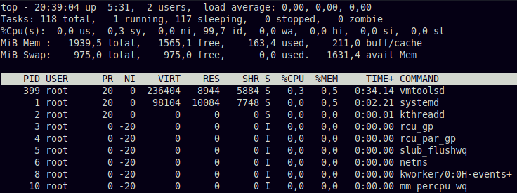

# Administración de procesos

## Procesos

Un proceso es un programa en ejecución que se encuentra en memoria. Un programa puede instanciar varios procesos.

> **Nota**: Un programa es un conjunto de instrucciones o comandos diseñado para realizar alguna tarea específica en una computadora, pueden estar contenidas en archivos binarios o en scripts (*def. cr*).
>
> ¿Diferencias entre programas y comandos? 
>
> R. (cr) Frente a los procesos ambos son lo mismo. Pero aquí hay un blog que indica las diferencias [Difference between Program and Command](https://www.geeksforgeeks.org/difference-between-program-and-command/).

Cada proceso tiene asociado un identificador numérico único, denominado ***process ID (PID**)*  

>**Note**: *After a process terminates, the kernel can eventually reuse the PID for a new process.* (ward, 2021, p. 70)

Los procesos se manejan de manera jerárquica, es decir, un proceso tiene un proceso padre y puede tener procesos hijos.

> El PPID (Parent PID) es el identificador del proceso padre.

Por ejemplo, la shell actual tiene un PID, se puede consultar a través de la variable de entorno `$$` y su Parent PID está en `$PPID`

```bash
# Imprime el PID de la shell actual
echo $$ 

# Imprime el PPID de la shell actual
echo $PPID
```

### Estados de un proceso

Todos los procesos tiene un estado, cambian con el tiempo:

- RUNNING (R) - En ejecución. Es un proceso que se esta ejecutando de forma activa en la CPU. 

  > RUNNABLE (R) - Proceso ejecutable, es decir que no esta haciendo uso de la CPU, pero está listo para ser ejecutado.

- SLEEP - En espera, porque necesita de recursos que no están disponibles. Aquí se puede distinguir dos estados sleep:

  - SLEEP INTERRUPTIBLE (S) - En espera de algún evento. es posible interrumpirlo.
  - SLEEP UNINTERRUPTIBLE (D) - Es igual que el anterior, pero no es posible interrumpirlo. Normalmente usado por *drivers* que esperan I/O.

- STOPPED (T) - Detenido (congelado o "en pausa"), se ha detenido su ejecución pero no ha terminado.

- ZOMBIE (Z) - Es un proceso que debería haber muerto, pero su padre no lo libera.

- TERMINADO - El procesos ha finalizado o muerto.

> **Nota 1**: (running = en CPU) - *Running* es el único estado que hace uso de la CPU, en los demás estados los procesos solo viven en memoria.

### Procesos Demonios

**Demonios o Daemons** - Son un tipo de proceso que **se ejecuta constantemente en segundo plano**.

Suelen identificarse porque tienen una "d" al final de su nombre, p.e. del servicio SSH su demonio es sshd.

Características de un demonio:

- Arrancan al iniciar el Sistema Operativo.

- Siempre están en ejecución, si se detiene otro programa lo volverá a levantar.

- Se ejecutan en segundo plano y no tiene asociado ninguna terminal.

- Algunos demonios se encargan de monitorear partes del sistema.

- Suelen estar a la espera de un evento o una solicitud (proveen servicios, a usuarios, otros programas o a través de la red). 

  > **Ejemplo**. el demonio *httpd* escucha solicitudes web, o crond un servicio que realiza tareas rutinarias programadas cada cierto tiempo.

- Los mas conocidos son los demonios de servicios de red (httpd, sshd, squid, etc.)

Los servicios suelen tener un usuario creado específicamente para ejecutar su demonio por cuestiones de seguridad, ya que si un servicio se ve comprometido, esto afectará a otros servicios y tampoco podrán acceder a archivos de otros usuarios.

### Proceso init

Proceso *init* se ejecuta después de que se ha cargado el kernel. Es el primer proceso y se encarga de arrancar todos los demás procesos, por eso se denomina padre de todos los procesos. Tiene asignado el PID 1.

Si por algún motivo un proceso queda huérfano (sin proceso padre), el proceso *init* será su padre.

## Listar los procesos

Para ver la lista de procesos, se puede usar el comando **ps**, 

### Comando ps

Muestra **una instantánea** de los procesos. 

 `ps [opciones] <params>` 

El comando `ps` sin opciones muestra los procesos de la terminal actual

```bash
carlos@debian:~$ ps
    PID TTY          TIME CMD
   3176 pts/0    00:00:00 bash
   3178 pts/0    00:00:00 ps
```

- PID - identificador del proceso
- TTY - La terminal donde el procesos se está ejecutando.
- TIME - Tiempo que el proceso ha usado la CPU.
- CMD - Comando que realizó la ejecución.

> El valor `?` en la columna tty indica que el proceso no está asociado a ninugna terminal.

#### Opciones del comando `ps`:

- `-x`  Muestra los procesos del usuario actual (incluye *daemons* asociados al usuario).

- `-a`  Muestra los procesos de todos los usuarios (incluso del root), No incluye *daemons*.

  > `-ax`  Muestra todos los procesos incluso los *daemons* de todos los usuarios.

- `-u`  Muestra mas detalles como el nombre del usuario, estado, hora inicio, etc.

- `-f`  Nos muestra en forma de árbol las relaciones de procesos.

```bash
# Muestra procesos que se este ejecutando en la terminal actual
ps

# Procesos que se este ejecutando en la terminal actual, pero de forma mas detallada
ps -l

# Visualizar información detallada de todos los procesos.
ps -aux
ps -auxf #para mostrar la jerarquia de árbol

# Visualizar la relacion los demonios y servicios que estan ejecutando en 2do plano con su arbol de procesos
ps -xf
```

#### Más opciones:

`-C <nom-proceso> ` Busca cualquier proceso del sistema operativo por su nombre

`-U <nombre-usuario> ` Buscar procesos relacionados con un usuario.

```bash
ps -C sleep
# Muestra el proceso sleep, no importa si se encuentra en otra terminal

ps -U alex 
# Muestra los procesos relacionados con el usuario Alex
```


Combinando opciones para una mejor visualización de la información:

```bash
ps -U postgres uxf 
# Muestra los procesos del usuario postgres,tambien muestra los demonios, el nombre de usuario y en formato arbol de procesos
```

> Es posible especificar las opciones al estilo BSD, es decir, no es necesario colocar el carácter menos `-` delante de las opciones. p.e. `ps aux`

#### Salida el comando `ps`

```bash
curso@debian:~/zombie$ ps aux | head
USER         PID %CPU %MEM    VSZ   RSS TTY      STAT START   TIME COMMAND
root           1  0.0  0.5  98104 10084 ?        Ss   15:07   0:02 /sbin/init
root           2  0.0  0.0      0     0 ?        S    15:07   0:00 [kthreadd]
message+     460  0.0  0.1   8016  3880 ?        Ss   15:07   0:00 /usr/bin/dbus
root         608  0.0  0.4  14444  8688 ?        Ss   15:28   0:00 sshd: curso [priv]
curso        963  0.0  0.0   9524  1456 pts/0    R+   19:20   0:00 ps aux
```

La mayoría de las columnas son intuitivas su significado, otros:

- **VSZ** Tamaño de la memoria virtual del proceso en Kb.

- **RSS** Tamaño de la memoria física usada en Kb.

- **STAT** Estado del proceso:

  -   R En ejecución o ejecutable (en cola de ejecución).
  -   S Interrumpible sleep (espera de un evento).
  -   D Ininterrumpible sleep (usualmente IO).
  -   T Detenido (job control).
  -   Z Zombie.

  Algunos tienen modificadores de estado:

  -   `N` Tiene una prioridad menor que lo normal.
  -   `<` Tiene una prioridad mayor que lo normal.
  -   `l` Proceso con múltiples hilos.
  -   `s` Es el proceso líder un grupo de procesos (sesión), p.e. una terminal suele ser este tipo.

- **TTY** terminal a la que esta asociado al proceso, si es `?` no está asociado a una terminal.

- **TIME** tiempo de usó de CPU en la ejecución.

> Ver la lista completa en `man ps` sección "*STANDARD FORMAT SPECIFIERS*"

> Ejercicios, para practicar con tuberias: 
>
> 1. ¿Cuántos procesos hay en ejecución en la máquina?
> 2. ¿Cuántos procesos que empiecen por k están corriendo? 

## Matar procesos

Matar un proceso es terminar su ejecución, para esto se puede enviar una señal desde el kernel al proceso.

### Comando kill

El comando `kill` permite enviar señales a un proceso, 

`kill [-señal] <PID>`

Para **terminar un proceso** se envía la señal `TERM`.

```bash
kill -TERM 12345

# TERM es por defecto, se puede omitir
kill 12345

# Se puede terminar varios procesos a la vez
kill 123 543 2341 3453
```


Si el procesos no se detiene por algún motivo, **se puede forzar** con la señal `KILL`.

```bash
kill -KILL 12345
```

> **Importante**: La señal `KILL` debe ser el último recurso a usarse para matar un procesos.


Es posible usar números en vez de los nombre de las señales.

```bash
kill -9 12345
#La opción -9 hace exactamente lo mismo que -KILL
```

`kill -l` muestra el mapeo de los números y los nombres de señales.


---

> `pkill` Comando similar a kill, recibe como parametro una expresión regular que empareje con el nombre del proceso.
>
> <!--BUSCAR EJEMPLOS-->

---

## Señales

Una señal es un mensaje que se envía desde el kernel a un proceso. 

Las señales pueden enviarse en cualquier momento, si el proceso está en ejecución, se detendrá y tratará la señal.

Las señales solo lo pueden ser enviados por el kernel u otros procesos del mismo usuario. No se puede enviar señales a procesos de otros usuarios excepto el root.

Las señales nos permiten controlar el ciclo de vida de los procesos (cambiar su estado).

Los usuarios pueden usar el comando `kill` para enviar señales. 

> Si bien el usuario utiliza este comando, en realidad el kernel enviará la señal por el usuario.

Existen varios **tipos de señales**, algunos de los más utilizados por los usuarios:

- La señal `TERM` termina la ejecución del proceso.

  > es la opción por defecto del comando `kill`

- Para detener un proceso, se envía la señal `STOP`

- Un proceso detenido puede reanudarse con la señal `CONT`

- La señal `INT` interrumpe el proceso (lo termina), lo usual es enviarlo mediante el atajo de teclas *CTRL+C*.

- Señal `KILL` es el el último recurso que se debe usar para terminar un proceso que no quiere morir. Básicamente lo fuerza a terminar.

La lista completa de señales esta en: `kill -l` 

Ejemplo:

```bash
curso@debian:~$ sleep 120 &	#crear un proceso en bg
[1] 981								#PID
curso@debian:~$ jobs
[1]+  Ejecutando              sleep 120 &
curso@debian:~$ kill -STOP 981
curso@debian:~$ jobs
[1]+  Detenido                sleep 120
curso@debian:~$ kill -CONT 981
curso@debian:~$ jobs
[1]+  Ejecutando              sleep 120 &
curso@debian:~$ kill -TERM 981
curso@debian:~$ jobs
[1]+  Terminado               sleep 120

# Nuevamente creamos pero lo vamos a interrumpir
curso@debian:~$ sleep 120 &
[1] 983
curso@debian:~$ kill -INT 983
curso@debian:~$ jobs
[1]+  Interrupción           sleep 120
curso@debian:~$ jobs
curso@debian:~$ # El proceso a terminado

# Un proceso "detenido" no puede ser terminado ni
# interrumpido, solo se lo puede forzar a morir
curso@debian:~$ sleep 120 &
[1] 986
curso@debian:~$ kill -STOP 986
curso@debian:~$ jobs
[1]+  Detenido                sleep 120
curso@debian:~$ kill -INT 986
curso@debian:~$ jobs
[1]+  Detenido                sleep 120 # no tuvo efecto
curso@debian:~$ kill -TERM 986
curso@debian:~$ jobs
[1]+  Detenido                sleep 120 # tampoco
curso@debian:~$ kill -KILL 986
curso@debian:~$ jobs
[1]+  Terminado (killed)      sleep 120 # muere forzosamente
```


## Más comandos 

### Comando pidof

Comando para saber el PID de un proceso, se le pasa el o los nombres del proceso.

`pidof <nombre-proceso> [<nom-otro-proc> ...]`  

```bash
pidof bash
#6543 69854  # porque hay dos terminales corriendo bash 

pidof nano vlc
#7333 30359
```

### Comando pgrep

Similar a *pidof*, tambien retorna el PID de procesos, pero *pgrep* recibe como parámetro un expresión regular.

`pgrep [options] <reg-exp>`

- `-l` Lista el PID y el nombre del proceso
- `-i` para ignorar mayúsculas y minúsculas

```bash
pgrep '^mate' 
# Imprime los PID que su nombre comienzan con 'mate'
```

## Procesos en primer y segundo plano

El usuario puede tener un programa corriendo bajo dos modalidades diferentes:

1. Procesos en *foreground* (primer plano) - Son aquellos que se ven en la terminal y que están interactuando con el usuario. Solo se puede tener un proceso en primer plano.
2. Procesos en *background* (segundo plano) - Son programas que se ejecutan a trasfondo por lo que no se los ve.

### Job control - Cambiar procesos entre bg y fg

Jobs se refiere a los procesos que corren en background o foreground

Job control es la capacidad de manipular estos procesos para detener y cambiar entre estos procesos.

Para manipular los jobs, se usa las señales `TSTP` (similar a *STOP*) y `CONT`

>La señal `TSTP` detiene al proceso y lo envía a segundo plano.


Con la combinación de teclas **CTRL+Z** se puede enviar la señal `TSTP`, el proceso se detendrá y pasará a segundo plano. por ende nos devolverá el prompt.

Para reanudar la ejecución del proceso, tenemos los comandos:

- `fg [id-job]` - retornará la ejecución a foreground.
- `bg [id-job ...]`  - continua la ejecución en background.

> **Nota**: Si no se pasa el `id-job` por defecto el último proceso que se detuvo se reanudará.

> Según el libro HLW esta utilidad de job control no es necesario.

#### Comando jobs

Muestra los procesos que están en segundo plano de la shell actual.

```bash
jobs
#[1]   Stopped                 sleep 60
#[2]-  Stopped                 sleep 120
#[3]+  Stopped                 nano
```

- La primera columna muestra el IDJOB
- La segunda columna el estado del proceso
- Y por último el comando que lanzó el proceso.

> `jobs -l` muestra mas info (como el PID)

> ¿Qué significa el signo `+` y `-`?
>
> Según esta página, estos signos solo indican cual es el último y penúltimo proceso en background. https://tldp.org/LDP/abs/html/x9644.html#JOBIDTABLE

Ejemplo:

```bash
#Vamos a crear 3 procesos y los vamos a detener ctrl+z
curso@debian:~$ sleep 120
^Z
[1]+  Detenido                sleep 120
curso@debian:~$ sleep 60
^Z
[2]+  Detenido                sleep 60
curso@debian:~$ sleep 30
^Z
[3]+  Detenido                sleep 30
curso@debian:~$ jobs	# Verificamos que estan detenidos
[1]   Detenido                sleep 120
[2]-  Detenido                sleep 60
[3]+  Detenido                sleep 30
curso@debian:~$ bg 1 2	# Reanudamos los dos primeros en bg
[1] sleep 120 &
[2]- sleep 60 &
curso@debian:~$ jobs
[1]   Ejecutando              sleep 120 &
[2]-  Ejecutando              sleep 60 &
[3]+  Detenido                sleep 30
curso@debian:~$ fg		# Reanudamos el último en fg
sleep 30
```

### Ejecución de procesos a background

Normalmente para enviar procesos a segundo plano se añade el carácter `&` al final del comando.

Por ejemplo, si se tiene un archivo muy grande para descomprimir: 

```bash
$ gunzip file.gz &
[1] 1044
```

La salida del comando mostrará el IDJOB (1) y PID (1044)

> Según el libro HLW (no lo he probado) "*If the process takes a very long time, it can even continue to run after you log out,*"

---

>**Ejecución en backgroung en maquinas remotas**
>If you’re remotely accessing a machine and want to keep a program running when you log out, you may need to use the `nohup` command;

---

El libro indica además de que debemos tener cuidado con los proceso en background, ya que si este intenta leer del std-in podría detenerse o terminar. <!--(NO LO TENGO MUY CLARO ESTO, CON UN EJEMPLO QUIZAS SE COMPRENDERIA MEJOR)--> 

Lo mismo con la std-out o std-err (terminal) ocacionalemente se mezclarían los mensajes del proceso en segundo plano y lo que se esté ejecutando en primer plano. 

> Se recomienda usar redireccionamiento para evitar mostrar, la salida del proceso en segundo plano, en la terminal

## Seguimiento de procesos

Realizar seguimiento de procesos puede ser útil para saber cuanto de recursos están siendo utilizados.

> Los recursos de hardware son: CPU, memoria y I/O (flujo de E/S, disco, red, cola de impresión, etc.)

### Comando top 

Nos permite ver en **tiempo real** todos los procesos, se actualiza cada 3 seg (pero so puede cambiar)

```bash
top
```



> Presionar 'q' para salir

Se puede interactuar con el programa top, para ordenar y filtrar la lista de procesos:

- **Spacebar** Updates the display immediately
- **M** Sorts by current resident memory usage
- **T** Sorts by total (cumulative) CPU usage
- **P** Sorts by current CPU usage (the default)
- **u** Displays only one user’s processes
- **f** Selects different statistics to display
- **?** Displays a usage summary for all top commands


### Comandos htop y atop

Los programas `htop` y `atop`, son similar a *top*, nos permite visualizar de una forma mas estética y amigable los procesos del Sistema Operativo. E

> Es una herramienta externa, se requiere su instalación.

### Comando lsof

Muestra una lista de los archivos abiertos y los procesos que los utilizan.

La salida de este comando es muy extenso. Pero dos opciones más comunes, son:

1. Pasar un *directorio* como argumento para listar las entradas que emparejen

   ```bash
   lsof +D /usr
   ```

2. Pasar un PID para listar los archivos abiertos y usados por ese proceso

   ```bash
   lsof -p 12345
   ```

> **Nota**  run `lsof -h` for most options.

## Threads

> Treads, hilos, hilos de ejecución o subprocesos son términos similares.

En Linux, algunos procesos se dividen en *threads*, un *thread* es muy similar a un proceso, tiene un identificador **Thread ID** (TID), el kernel se encarga de ejecutarlos.

Todos los *threads* de un proceso comparten recursos del sistema (memoria).

Un proceso con un solo *thread* es denominado *single-threaded*, y un proceso con más de un *thread* es *multithreaded*.

Todos los procesos inician con un *single-threaded* también denominado ***main thread***, y este puede iniciar nuevos *threads*.

La principal ventaja de un proceso *multithreaded* es que pueden ejecutarse simultáneamente en múltiples procesadores.

Para ver los *threads*, se puede usar el comando `ps` con la opción `m`

```bash
carlos@debian:~$ ps am
    PID TTY      STAT   TIME COMMAND
    788 tty7     -     34:09 /usr/lib/xorg/Xorg :0 -s
      - -        Ssl+  32:15 -
      - -        SNsl+   0:00 -
      - -        SNsl+   0:00 -
   7406 pts/0    -      0:00 bash
      - -        Ss+    0:00 -
```

Las líneas que tiene guiones, indican los *threads* de un proceso, p.e. el PID 788 tiene 3 *threads* (*process multithreaded*).

Para ver el TID se puede usar la opción `-o` para una salida personalizar del comando `ps`

```bash
carlos@debian:~$ ps am -o pid,tid,command
    PID     TID COMMAND
    788       - /usr/lib/xorg/Xorg :0 -seat
      -     788 -
      -     817 -
      -     818 -
   7406       - bash
      -    7406 -
```

> **Nota** El TID del *main thread*  tiene el mismo número que el PID de su proceso.

---

<!--Monitoreo de recursos-->

​	<!--Tiempo de uso CPU, prioridad de procesos, monitoreo memoria, monitoreo de I/O-->

<!--CGroups-->

---

## Extra

### Procesos de Usuarios

Muchos de los procesos son de este tipo, Estos procesos los inicia un usuario regular y lo ejecuta en el espacio de usuario.

### Procesos del kernel

Se ejecutan solo en el espacio del kernel, Son similares a los demonios, pero la principal diferencia es que estos procesos tienen acceso a la estructura de datos del kernel.

---

El comando `top` muestra el porcentaje de uso de la cpu de los procesos usuario y de kernel:

```
top - 12:28:34 up 44 min,  2 users,  load average: 0,06, 0,02, 0,00
Tasks: 118 total,   1 running, 117 sleeping,   0 stopped,   0 zombie
%Cpu(s):  0,0 us,  1,0 sy,  0,0 ni, 99,0 id,  0,0 wa,  0,0 hi,
```

 La linea `0,0 us,  1,0 sy,`, `us` procesos de usuario (ejecución user mode) y `sy` procesos de kernel (ejecución kernel mode).

---

### Procesos zombies

Todos los procesos, en su ciclo de vida, pasan por este estado antes de terminar (o morir), y dependiendo de las circunstancias pueden quedar así temporalmente o casi "permanentemente".

#### ¿Cómo se crean los procesos zombies?

Los procesos pueden terminar de dos maneras:

1. Reciben una señal del kernel para terminar (p.e. `SIGTERM` o `SIGKILL`).

   > En este caso el proceso terminará correctamente.

2. Utilizan, ellos mismos, la llamada al sistema `exit()` para terminar. 

En el segundo caso sucede varias cosas, luego de hacer la llamada `exit()`, el proceso libera sus recursos (memoria, archivos utilizados, etc) pero su espacio en la tabla de procesos aun seguirá ocupado hasta que su proceso padre lo liberé.

> *(Hasta este punto técnicamente el procesos "muere".)*

> ¿Qué es la tabla de procesos?
>
> R. Es una estructura de datos que el kernel utiliza para rastrear a todos los procesos, es aquí donde reside su PID.

Luego de liberar sus recursos, el proceso hijo envía una señal `SIGCHLD` al padre para notificarlo que ya terminó su tarea y está listo para ser liberado. 

El padre recopila el estado del proceso hijo terminado a través de la llamada al sistema `wait()` o `waitpid()` y procede a liberar su espacio de la tabla de procesos

Durante el tiempo que el procesos termina y el padre lo libera, el proceso pasa a un **estado zombie**.

#### ¿Qué pasa si el padre no lo libera al hijo o muere antes que el hijo?

Si un proceso padre ignora la señal `SIGCHLD` (o no llama a `wait()`), el proceso hijo **quedará en estado zombie mientras el padre esté activo**.

Si el proceso padre muere antes de liberar al hijo, el proceso hijo quedará en estado zombie, pero al  ya no tener padre, el proceso *init* se convierte en su padre y es este será quién liberará su espacio de la tabla de procesos.

>*Init constantemente esta buscando este tipo de procesos para liberarlos*. En resumen el S.O. se encargará y no debería ser una preocupación del administrador.

---

> **Zombie Process**
>
> In the zombie state, the child process is considered dead, but its entry in the process table remains. The kernel retains the process information, including the process ID (PID) and exit status, until the parent process retrieves it.
>
> The zombie process consumes minimal system resources, as it only occupies an entry in the process table and a small amount of memory. However, it does not actively consume CPU resources. ref https://www.scaler.com/topics/zombie-process-in-linux/

---

#### ¿Cómo matar a un proceso zombie?

No es posible matar un procesos zombie porque técnicamente ya no existe.

El único responsable de liberar a un proceso zombie, es su padre.

Pero matando al padre, el hijo queda huérfano entonces *init* se encargará de eliminarlo.

#### Experimentar con procesos zombies

> Por cuestiones didácticas vamos a experimentar con un programa de juguete que crea zombies. 

Vamos a crear un proceso zombie, Para esto vamos a crear un proceso hijo que se ejecutará por 5seg y el padre se ejecutará por, mas tiempo, 10seg además el padre no consultará el estado de sus hijos para liberarlos, es así que el hijo convertirá en zombie. 

Crear un archivo python, llamado `zombie.py`

```python
import os
import time

def main():
    pid = os.fork() # crea un proceso hijo, será 
    				# exactamente igual que el padre
	# En este punto hay dos procesos (padre e hijo)
    if pid == 0:  # Este es el proceso hijo
        print("Soy el proceso hijo")
        time.sleep(5)
        print("Proceso hijo finalizado")
        #os_exit(0) #no es necesario, python ya lo hace
    else:  # Este es el proceso padre
        print("Soy el proceso padre")
        print(f"El proceso hijo tiene PID {pid}")
        #os.wait()  # esta es la manera correcta para
        			# el q hijo no se vuelva zombie
        time.sleep(10)
        print("Proceso padre finalizado")

if __name__ == "__main__":
    main()
```


1. Ejecuta el script desde la línea de comandos:

   ```bash
   python zombie.py
   ```

2. Mientras el script está en ejecución, abre otra terminal y usa el siguiente comando para ver todos los procesos en el sistema, incluyendo los Zombis:

   ```bash
   ps a | grep zombie.py
   ```

   > También se puede usar `top` para ver los procesos zombies
   >
   > ```bash
   > top - 12:28:34 up 44 min,  2 users,  load average: 0,06, 0,02, 0,00
   > Tasks: 118 total,   1 running, 117 sleeping,   0 stopped,   0 zombie  <<----
   > ```

3. Verás dos procesos relacionados con `zombie.py`, uno será el proceso padre y el otro será el proceso hijo *(Esto antes de los 5seg)*.

4. Luego de los 5 seg y antes de los 10 seg, volver a ver el estado de los procesos `ps a`, verás que el proceso hijo se queda en estado zombie.

   Esto sucede porque el padre no hace la llamada `wait()` para comprobar el estado del hijo y así liberarlo. 

La manera correcta de terminar los procesos hijos es que, el desarrollador, siempre añada a sus programas la instrucción `wait()` o `waitpid()`.

Descomentar la linea que tiene la instrucción `wait()` y volver a comprobar los pasos anteriores. Se verificará que efectivamente ya no hay zombies.

```
Lo que está sucediendo es lo siguiente:
PP  >----------------------------------x
									   |    
PH  >-------x PP no libera, PH zombie  | PH huerf. muere
```

> ten en cuenta que la creación de procesos Zombis en situaciones reales no es algo que se deba buscar, sino algo que se debe evitar.

Ejemplo en C:

```c
#include <stdio.h>
#include <stdlib.h>
#include <sys/types.h>
#include <sys/wait.h>
#include <unistd.h>

int main() {
    pid_t child_pid;

    child_pid = fork(); // Create a child process

    if (child_pid < 0) {
        fprintf(stderr, "Fork failed\n");
        return 1;
    } else if (child_pid == 0) {
        // Child process
        printf("Child process executing\n");
        exit(0);
    } else {
        // Parent process
        printf("Parent process executing\n");
        sleep(5); // Parent process waits for 5 seconds

        // The parent process does not handle the termination of the child process
        // It does not invoke wait() or waitpid() to collect the exit status

        printf("Parent process terminate\n");
        printf("Zombie process dead\n");
    }

    return 0;
}
```


## Referencias

- Artículo estados de procesos - https://access.redhat.com/sites/default/files/attachments/processstates_20120831.pdf
- Librería os de python - https://docs.python.org/3/library/os.html
- Handling Zombie Processes in Linux - https://rvarago.medium.com/handling-zombie-processes-in-linux-80cc37447092

